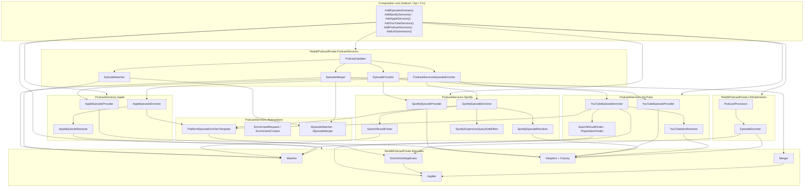
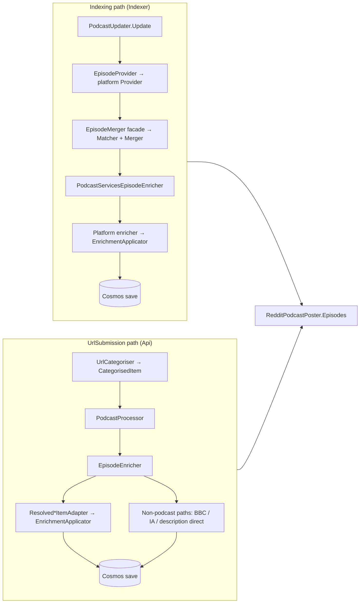
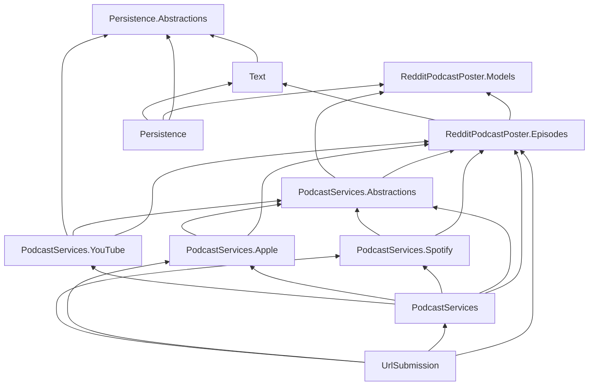

# \\\\\RedditPodcastPoster.Episodes — architecture

Platform-agnostic episode domain for **match**, **merge**, **apply**, and **adapt** operations. Platform API types stay in `PodcastServices.{Spotify,Apple,YouTube}`; this library owns the normalized model and algorithms.

**Status:** Phases A–E merged to `main` (#871–#875). Phase F cleanup in progress on `feature/episode-domain-phase-f-cleanup` — merge orchestration relocated, legacy tolerance removed, UrlSubmission unified on `IPlatformEnrichmentApplicator`.

**Related docs:** [Step 7 checklist](../../plans/episode-domain-refactor/STEP-7-CHECKLIST.md) · [Episode domain refactor plan](../../plans/episode-domain-refactor/README.md)

---

## Design principles


| Principle                                        | Detail                                                                                                                                                                                   |
| ------------------------------------------------ | ---------------------------------------------------------------------------------------------------------------------------------------------------------------------------------------- |
| **No platform references**                       | `RedditPodcastPoster.Episodes` references only `Models` and `Text`. Spotify/Apple/YouTube assemblies reference Episodes, not the reverse.                                                |
| **Adapters map**                                 | Foreign API / resolved-item DTOs → `EpisodeCandidate` at boundaries.                                                                                                                     |
| **Strategies match**                             | Release tolerance and cross-platform delay logic live in `IReleaseMatchStrategy` implementations (backed by domain `EpisodeReleaseTolerance`).                                           |
| **Policies merge**                               | Release backfill and authority rules live in `IReleaseMergePolicy` implementations.                                                                                                      |
| **Applier writes**                               | All platform field writes on an existing `Episode` go through `IEpisodePlatformApplier`.                                                                                                 |
| **Enrichment applicator**                        | Indexing enrichers and UrlSubmission `EpisodeEnricher` call `IPlatformEnrichmentApplicator.Apply()` — not the applier directly for platform links.                                       |
| **Orchestrators coordinate**                     | `PodcastUpdater`, `PodcastServicesEpisodeEnricher`, and UrlSubmission `EpisodeEnricher` call domain services or thin PodcastServices facades; they do not embed match/merge/apply logic. |
| **Merge orchestration lives in PodcastServices** | `EpisodeMatcher` / `EpisodeMerger` facades (implementing `IEpisodeMatcher` / `IEpisodeMerger`) sit in `PodcastServices`, not `Persistence`. Persistence is Cosmos-only.                  |


---

## Folder layout

```
RedditPodcastPoster.Episodes/
├── Domain/              EpisodeCandidate, PlatformLink, ReleaseInfo, EpisodePlatformPatch
├── Adapters/            IEpisodeCatalogueAdapter<T>, catalogue + resolved-item adapters
├── Applying/            IEpisodePlatformApplier, IPlatformEnrichmentApplicator
├── Matching/            IEpisodePlatformMatcher + IReleaseMatchStrategy chain
├── Merging/             IEpisodePlatformMerger + IReleaseMergePolicy chain
├── Factories/           IEpisodeFromCandidateFactory (candidate → new Episode)
├── Extensions/          Identity/mapping helpers; ServiceCollectionExtensions (AddEpisodesDomain)
├── EpisodeReleaseTolerance.cs   Domain tolerance helpers (replaces legacy Abstractions static)
└── architecture.md      This document
```

**Outside Episodes but part of the episode pipeline:**

```
PodcastServices/
├── EpisodeMatcher.cs    IEpisodeMatcher facade → IEpisodePlatformMatcher
├── EpisodeMerger.cs     IEpisodeMerger facade → IEpisodePlatformMatcher + IEpisodePlatformMerger
└── PodcastUpdater.cs    Indexing orchestrator

PodcastServices.Abstractions/
├── IEpisodeMatcher.cs · IEpisodeMerger.cs · EpisodeMergeResult
└── IndexPodcastResult.cs

PodcastServices.{Spotify,Apple,YouTube}/
└── Finders / resolvers   Platform catalogue boundary (map API types → domain matcher inputs)
```

---

## Diagram 1 — Episodes domain (internal)

How types inside this assembly relate. Solid arrows are “uses” or “produces”; dashed arrows are strategy/policy chains.

```mermaid
flowchart TB
    subgraph Models["RedditPodcastPoster.Models"]
        EP[(Episode / Podcast)]
    end

    subgraph DomainTypes["Domain value types"]
        EC[EpisodeCandidate]
        PL[PlatformLink]
        RI[ReleaseInfo]
        PATCH[EpisodePlatformPatch]
        TOL[EpisodeReleaseTolerance]
        EC --- PL & RI
    end

    subgraph Adapters["Adapters"]
        CAT[IEpisodeCatalogueAdapter<T><br/>Spotify / Apple / YouTube]
        RES[Resolved*ItemAdapter<br/>UrlSubmission path]
        FACT[IEpisodeFromCandidateFactory]
        CAT --> EC
        RES --> EC
        FACT --> EP
    end

    subgraph Matching["Matching"]
        MATCH[IEpisodePlatformMatcher<br/>EpisodePlatformMatcher]
        RS1[ExactReleaseMatchStrategy]
        RS2[SpotifyCatalogueReleaseMatchStrategy]
        RS3[YouTubePublishDelayMatchStrategy]
        MATCH -.-> RS1 & RS2 & RS3
        RS1 & RS2 & RS3 -.-> TOL
    end

    subgraph Merging["Merging"]
        MERGE[IEpisodePlatformMerger<br/>EpisodePlatformMerger]
        MP1[YouTubeAuthoritativePreserve]
        MP2[YouTubeTimeBackfill]
        MP3[SpotifyNoTimeBackfill]
        MP4[AppleTimeBackfill]
        MERGE -.-> MP1 & MP2 & MP3 & MP4
    end

    subgraph Applying["Applying"]
        APPLIER[IEpisodePlatformApplier<br/>EpisodePlatformApplier]
        ENRICH[IPlatformEnrichmentApplicator<br/>PlatformEnrichmentApplicator]
        ENRICH --> APPLIER
        ENRICH -.-> MP2 & MP4
    end

    CAT --> FACT
    MATCH --> EP
    MERGE --> APPLIER
    MERGE --> EP
    APPLIER --> PATCH
    APPLIER --> EP
    ENRICH --> EP
```




### Responsibilities


| Component                        | Role                                                                                                                                                                                                                                                                                          |
| -------------------------------- | --------------------------------------------------------------------------------------------------------------------------------------------------------------------------------------------------------------------------------------------------------------------------------------------- |
| **EpisodeCandidate**             | Normalized platform snapshot (title, duration, links, release) before apply or factory create.                                                                                                                                                                                                |
| **EpisodePlatformMatcher**       | Identity match, title/duration heuristics, catalogue lookup (`FindCatalogueMatchByLength/ByDate`, `IsCatalogueMatch`). Delegates release decisions to strategies (first non-null `bool?` wins).                                                                                               |
| **EpisodePlatformMerger**        | Merges incoming candidate into stored episode in place; uses applier for fill-missing platform fields and policy chain for release.                                                                                                                                                           |
| **EpisodePlatformApplier**       | Writes `EpisodePlatformPatch` onto `Episode` (links, description, release) without overwriting existing values unless policy allows.                                                                                                                                                          |
| **PlatformEnrichmentApplicator** | Shared enrich entry point (indexing + UrlSubmission): candidate → patch → applier + release backfill policies. Returns `PlatformEnrichmentResult`.                                                                                                                                            |
| **EpisodeReleaseTolerance**      | Domain static helpers for tolerance ticks, Spotify catalogue release comparison, audio-release lookup, and indexing scope (`ShouldEnrichDespiteReleaseWindow`). Used by strategies, matcher catalogue paths, and orchestration scope boundaries — not by enrichers for direct field mutation. |
| **Catalogue adapters**           | Map platform catalogue inputs (`SpotifyCatalogueInput`, etc.) to `EpisodeCandidate`.                                                                                                                                                                                                          |
| **Resolved-item adapters**       | Map UrlSubmission `Resolved*Item` DTOs to `EpisodeCandidate`.                                                                                                                                                                                                                                 |


### Strategy and policy order

Registered in `AddEpisodesDomain()` (`Extensions/ServiceCollectionExtensions.cs`):

**Match strategies** (chain — first applicable non-null result):

1. `ExactReleaseMatchStrategy`
2. `SpotifyCatalogueReleaseMatchStrategy`
3. `YouTubePublishDelayMatchStrategy`

**Merge policies** (chain — first decisive opinion):

1. `YouTubeAuthoritativePreserveMergePolicy`
2. `YouTubeTimeBackfillMergePolicy`
3. `SpotifyNoTimeBackfillMergePolicy`
4. `AppleTimeBackfillMergePolicy`

---

## Diagram 2 — Episodes + PodcastServices + platform specializations

How the domain sits between orchestration and platform assemblies. **Episodes is shared**; each platform project plugs in providers, enrichers, resolvers, and finders.




### Platform specialization pattern

Each platform assembly follows the same shape:


| Layer                         | Spotify                           | Apple                                 | YouTube                                    |
| ----------------------------- | --------------------------------- | ------------------------------------- | ------------------------------------------ |
| **Discovery**                 | `SpotifyEpisodeProvider`          | `AppleEpisodeProvider`                | `YouTubeEpisodeProvider`                   |
| **Enrich**                    | `SpotifyEpisodeEnricher`          | `AppleEpisodeEnricher`                | `YouTubeEpisodeEnricher`                   |
| **Resolve**                   | `SpotifyEpisodeResolver`          | `AppleEpisodeResolver`                | `YouTubeItemResolver`                      |
| **Find / catalogue boundary** | `SearchResultFinder`              | `AppleEpisodeResolver` (uses matcher) | `SearchResultFinder`, `PlaylistItemFinder` |
| **Side effects**              | `SpotifyExpensiveQuerySideEffect` | —                                     | —                                          |
| **Catalogue adapter**         | `SpotifyEpisodeAdapter`           | `AppleEpisodeAdapter`                 | `YouTubeEpisodeAdapter`                    |


Platform finders/resolvers are **not** thin forwards — they map platform API types to domain `Episode` probes/candidates and delegate release matching to `IEpisodePlatformMatcher`. YouTube finders additionally contain platform-specific heuristics (fuzzy title, episode number, duration gates).

Platform enrichers inherit `PlatformEpisodeEnricherTemplate` (in Abstractions):

```
Resolver finds catalogue item
  → IEpisodeCatalogueAdapter.Adapt() → EpisodeCandidate
  → [optional] IEpisodePlatformMatcher.CatalogueReleaseMatches filter
  → PlatformEpisodeEnricherTemplate.ApplyResolvedCandidate()
       → IPlatformEnrichmentApplicator.Apply()
       → PlatformEnrichmentResult.ApplyTo(EnrichmentContext)
```

YouTube enricher additionally calls `IEpisodePlatformApplier` directly for link-only backfill and supplemental video metadata (description, thumbnail).

---

## Diagram 3 — Runtime paths

Two production paths consume Episodes. Both platform enrich paths and UrlSubmission now converge on `**IPlatformEnrichmentApplicator**`.




| Path              | Host    | Domain entry points                                                                                  | Platform enrichers?                         |
| ----------------- | ------- | ---------------------------------------------------------------------------------------------------- | ------------------------------------------- |
| **Indexing**      | Indexer | Matcher, Merger, EnrichmentApplicator, catalogue adapters; `EpisodeMatcher`/`EpisodeMerger` facades  | Yes — Spotify → Apple → YouTube per episode |
| **UrlSubmission** | Api     | EnrichmentApplicator, resolved-item adapters; BBC/IA/description handled inline in `EpisodeEnricher` | No — resolved URL already known             |


**Indexing enrich order** (`PodcastServicesEpisodeEnricher`): for each new episode, explicit guards run Spotify then Apple then YouTube when links/IDs are missing (no `switch (Service)` enum loop). Delayed YouTube publishing triggers a **second pass** on recently expired episodes (orchestrator concern, not in platform enrichers).

**Out of scope:** Discovery `EpisodeResultsEnricher` — unchanged; does not use this domain pipeline.

---

## Dependency graph (projects)

Current state after Phase F layering work (F13–F16, F19). Remaining debt in **F17–F20**.




### Layering — resolved (Phase F)


| Issue                                                                  | Resolution                                                                          |
| ---------------------------------------------------------------------- | ----------------------------------------------------------------------------------- |
| `Persistence → Episodes`                                               | **Removed** — `EpisodeMatcher`/`EpisodeMerger` moved to `PodcastServices` (**F13**) |
| `IEpisodeMatcher` / `EpisodeMergeResult` in `Persistence.Abstractions` | **Moved** to `PodcastServices.Abstractions` (**F14**)                               |
| `Persistence → PodcastServices.Abstractions` orphan reference          | **Removed** (**F15**)                                                               |
| `PodcastServices.Abstractions → Persistence.Abstractions`              | **Removed** — `IndexPodcastResult` uses orchestration DTOs only (**F16**)           |
| `Episodes.TestSupport → Persistence` for merger construction           | **Removed** — uses `PodcastServices` facades (**F19**)                              |
| Legacy `EpisodeReleaseMatchTolerance` in Abstractions                  | **Deleted** — call sites use domain `EpisodeReleaseTolerance` (**F1**)              |


### Layering — still open (Phase F)


| Issue                                                                                        | Why it matters                                                  | Phase F action |
| -------------------------------------------------------------------------------------------- | --------------------------------------------------------------- | -------------- |
| `UrlSubmission → PodcastServices` (concrete) + platform `Resolved*Item` on `CategorisedItem` | Submit path pulls indexing aggregator + foreign platform models | **F17**        |
| `Text` hosts `KnownTermsRepository`                                                          | Text library implements Cosmos repos                            | **F18**        |
| `PodcastServices.YouTube → Persistence.Abstractions`                                         | Platform assembly knows repo interfaces for quota state         | **F20**        |


---

## DI registration

Hosts that need episode processing must call `**AddEpisodesDomain()`** explicitly. It is **not** nested inside `AddRepositories()`, `AddPodcastServices()`, or `AddUrlSubmission()`.

Hosts that need indexing merge orchestration must also call `**AddPodcastServices()`**, which registers `IEpisodeMatcher` / `IEpisodeMerger` facades (these depend on domain services from `AddEpisodesDomain()`).

Import `RedditPodcastPoster.Episodes.Extensions` at the composition root (same pattern as `Persistence.Extensions`).


| Extension              | Registers                                                                                                                                                  |
| ---------------------- | ---------------------------------------------------------------------------------------------------------------------------------------------------------- |
| `AddEpisodesDomain()`  | Applier, enrichment applicator, merger, matcher, 3 strategies, 4 policies, factory, 3 catalogue adapters                                                   |
| `AddPodcastServices()` | `**IEpisodeMatcher**`, `**IEpisodeMerger**`, `PodcastUpdater`, `PodcastServicesEpisodeEnricher`, metadata handlers (does **not** register Episodes domain) |
| `AddSpotifyServices()` | Spotify provider, enricher, resolver, finder, side effect                                                                                                  |
| `AddAppleServices()`   | Apple provider, enricher, resolver                                                                                                                         |
| `AddYouTubeServices()` | YouTube provider, enricher, resolver, finders                                                                                                              |
| `AddRepositories()`    | Cosmos repositories only (no episode domain)                                                                                                               |
| `AddUrlSubmission()`   | UrlSubmission pipeline including `IEpisodeEnricher` (does **not** register Episodes domain)                                                                |


**Typical Indexer host:** `AddEpisodesDomain()` → `AddRepositories()` → `Add*Services()` → `AddPodcastServices()`.

**Typical Api host:** same, plus `AddUrlSubmission()`.

---

## Key source files


| Area                        | Path                                                                                               |
| --------------------------- | -------------------------------------------------------------------------------------------------- |
| DI (domain)                 | `Extensions/ServiceCollectionExtensions.cs`                                                        |
| Tolerance                   | `EpisodeReleaseTolerance.cs`                                                                       |
| Matcher                     | `Matching/IEpisodePlatformMatcher.cs`, `Matching/EpisodePlatformMatcher.cs`                        |
| Merger (domain)             | `Merging/IEpisodePlatformMerger.cs`, `Merging/EpisodePlatformMerger.cs`                            |
| Applier                     | `Applying/IEpisodePlatformApplier.cs`, `Applying/EpisodePlatformApplier.cs`                        |
| Enrichment applicator       | `Applying/IPlatformEnrichmentApplicator.cs`, `Applying/PlatformEnrichmentApplicator.cs`            |
| Merge orchestration facades | `../RedditPodcastPoster.PodcastServices/EpisodeMatcher.cs`, `EpisodeMerger.cs`                     |
| Orchestration contracts     | `../RedditPodcastPoster.PodcastServices.Abstractions/IEpisodeMatcher.cs`, `IEpisodeMerger.cs`      |
| Enricher template           | `../RedditPodcastPoster.PodcastServices.Abstractions/Enriching/PlatformEpisodeEnricherTemplate.cs` |
| Indexing orchestrator       | `../RedditPodcastPoster.PodcastServices/PodcastUpdater.cs`                                         |
| Indexing enrich facade      | `../RedditPodcastPoster.PodcastServices/PodcastServicesEpisodeEnricher.cs`                         |
| UrlSubmission enrich        | `../RedditPodcastPoster.UrlSubmission/EpisodeEnricher.cs`                                          |
| DI (orchestration)          | `../RedditPodcastPoster.PodcastServices/Extensions/ServiceCollectionExtensions.cs`                 |


---

## Testing

Business-rule tests live in `RedditPodcastPoster.Episodes.Tests` (matcher, merger, applier, adapters, tolerance). Platform and UrlSubmission paths have characterization tests in their respective test projects. Coverage gates and baselines: `plans/episode-domain-refactor/coverage-baseline.json`, `./scripts/coverage-gate.ps1`.

Test support: `RedditPodcastPoster.Episodes.TestSupport` provides `EpisodeDomainTestServices` (applier, enrichment applicator, merger/matcher via PodcastServices facades) and shared fixtures/assertions.