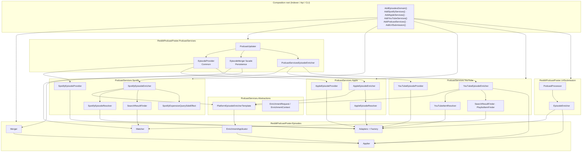
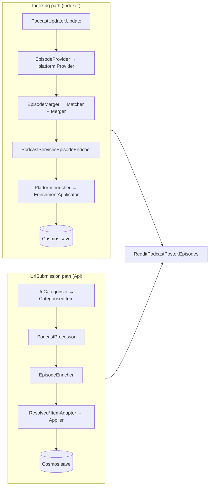
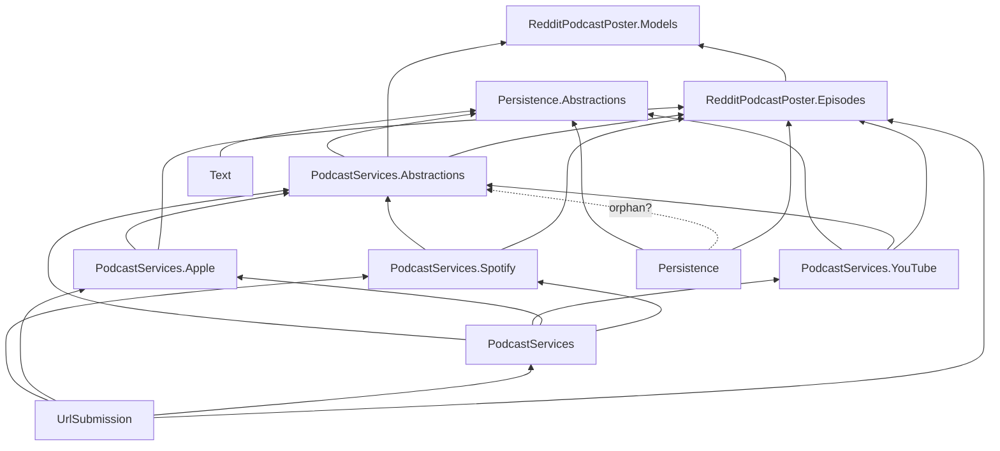
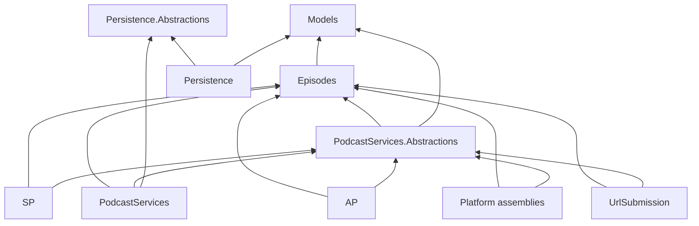

# RedditPodcastPoster.Episodes — architecture

Platform-agnostic episode domain for **match**, **merge**, **apply**, and **adapt** operations. Platform API types stay in `PodcastServices.{Spotify,Apple,YouTube}`; this library owns the normalized model and algorithms.

**Related docs:** [Step 7 checklist](../../plans/episode-domain-refactor/STEP-7-CHECKLIST.md) · [Episode domain refactor plan](../../plans/episode-domain-refactor/README.md)

---

## Design principles

| Principle | Detail |
|-----------|--------|
| **No platform references** | `RedditPodcastPoster.Episodes` references only `Models` and `Text`. Spotify/Apple/YouTube assemblies reference Episodes, not the reverse. |
| **Adapters map** | Foreign API / resolved-item DTOs → `EpisodeCandidate` at boundaries. |
| **Strategies match** | Release tolerance and cross-platform delay logic live in `IReleaseMatchStrategy` implementations. |
| **Policies merge** | Release backfill and authority rules live in `IReleaseMergePolicy` implementations. |
| **Applier writes** | All platform field writes on an existing `Episode` go through `IEpisodePlatformApplier` (or `IPlatformEnrichmentApplicator` for indexing enrich). |
| **Orchestrators coordinate** | `PodcastUpdater`, `PodcastServicesEpisodeEnricher`, and UrlSubmission `EpisodeEnricher` call domain services; they do not embed match/merge/apply logic. |

---

## Folder layout

```
RedditPodcastPoster.Episodes/
├── Domain/           EpisodeCandidate, PlatformLink, ReleaseInfo, EpisodePlatformPatch
├── Adapters/         IEpisodeCatalogueAdapter<T>, catalogue + resolved-item adapters
├── Applying/         IEpisodePlatformApplier, IPlatformEnrichmentApplicator
├── Matching/         IEpisodePlatformMatcher + IReleaseMatchStrategy chain
├── Merging/          IEpisodePlatformMerger + IReleaseMergePolicy chain
├── Factories/        IEpisodeFromCandidateFactory (candidate → new Episode)
├── Extensions/       Identity/mapping helpers; ServiceCollectionExtensions (AddEpisodesDomain)
```

---

## Diagram 1 — Episodes domain (internal)

How types inside this assembly relate. Solid arrows are “uses” or “produces”; dashed arrows are strategy/policy chains.

```mermaid
flowchart TB
    subgraph Models["RedditPodcastPoster.Models"]
        EP[(Episode / Podcast)]
    end

    subgraph DomainTypes["Domain value types"]
        EC[EpisodeCandidate]
        PL[PlatformLink]
        RI[ReleaseInfo]
        PATCH[EpisodePlatformPatch]
        EC --- PL & RI
    end

    subgraph Adapters["Adapters"]
        CAT[IEpisodeCatalogueAdapter&lt;T&gt;<br/>Spotify / Apple / YouTube]
        RES[Resolved*ItemAdapter<br/>UrlSubmission path]
        FACT[IEpisodeFromCandidateFactory]
        CAT --> EC
        RES --> EC
        FACT --> EP
    end

    subgraph Matching["Matching"]
        MATCH[IEpisodePlatformMatcher<br/>EpisodePlatformMatcher]
        RS1[ExactReleaseMatchStrategy]
        RS2[SpotifyCatalogueReleaseMatchStrategy]
        RS3[YouTubePublishDelayMatchStrategy]
        MATCH -.-> RS1 & RS2 & RS3
    end

    subgraph Merging["Merging"]
        MERGE[IEpisodePlatformMerger<br/>EpisodePlatformMerger]
        MP1[YouTubeAuthoritativePreserve]
        MP2[YouTubeTimeBackfill]
        MP3[SpotifyNoTimeBackfill]
        MP4[AppleTimeBackfill]
        MERGE -.-> MP1 & MP2 & MP3 & MP4
    end

    subgraph Applying["Applying"]
        APPLIER[IEpisodePlatformApplier<br/>EpisodePlatformApplier]
        ENRICH[IPlatformEnrichmentApplicator<br/>PlatformEnrichmentApplicator]
        ENRICH --> APPLIER
        ENRICH -.-> MP2 & MP4
    end

    CAT --> FACT
    MATCH --> EP
    MERGE --> APPLIER
    MERGE --> EP
    APPLIER --> PATCH
    APPLIER --> EP
    ENRICH --> EP
```



### Responsibilities

| Component | Role |
|-----------|------|
| **EpisodeCandidate** | Normalized platform snapshot (title, duration, links, release) before apply or factory create. |
| **EpisodePlatformMatcher** | Identity match, title/duration heuristics, catalogue lookup (`FindCatalogueMatchByLength/ByDate`, `IsCatalogueMatch`). Delegates release decisions to strategies (first non-null `bool?` wins). |
| **EpisodePlatformMerger** | Merges incoming candidate into stored episode in place; uses applier for fill-missing platform fields and policy chain for release. |
| **EpisodePlatformApplier** | Writes `EpisodePlatformPatch` onto `Episode` (links, description, release) without overwriting existing values unless policy allows. |
| **PlatformEnrichmentApplicator** | Indexing enrich entry point: candidate → patch → applier + release backfill policies. Returns `PlatformEnrichmentResult`. |
| **Catalogue adapters** | Map platform catalogue inputs (`SpotifyCatalogueInput`, etc.) to `EpisodeCandidate`. |
| **Resolved-item adapters** | Map UrlSubmission `Resolved*Item` DTOs to `EpisodeCandidate`. |

### Strategy and policy order

Registered in `AddEpisodesDomain()` (`Extensions/ServiceCollectionExtensions.cs`, namespace `RedditPodcastPoster.Episodes.Extensions`):

**Match strategies** (chain — first applicable non-null result):

1. `ExactReleaseMatchStrategy`
2. `SpotifyCatalogueReleaseMatchStrategy`
3. `YouTubePublishDelayMatchStrategy`

**Merge policies** (chain — first decisive opinion):

1. `YouTubeAuthoritativePreserveMergePolicy`
2. `YouTubeTimeBackfillMergePolicy`
3. `SpotifyNoTimeBackfillMergePolicy`
4. `AppleTimeBackfillMergePolicy`

---

## Diagram 2 — Episodes + PodcastServices + platform specializations

How the domain sits between orchestration and platform assemblies. **Episodes is shared**; each platform project plugs in providers, enrichers, resolvers, and finders.



### Platform specialization pattern

Each platform assembly follows the same shape:

| Layer | Spotify | Apple | YouTube |
|-------|---------|-------|---------|
| **Discovery** | `SpotifyEpisodeProvider` | `AppleEpisodeProvider` | `YouTubeEpisodeProvider` |
| **Enrich** | `SpotifyEpisodeEnricher` | `AppleEpisodeEnricher` | `YouTubeEpisodeEnricher` |
| **Resolve** | `SpotifyEpisodeResolver` | `AppleEpisodeResolver` | `YouTubeItemResolver` |
| **Find / match helper** | `SearchResultFinder` | (resolver uses matcher) | `SearchResultFinder`, `PlaylistItemFinder` |
| **Side effects** | `SpotifyExpensiveQuerySideEffect` | — | — |
| **Catalogue adapter** | `SpotifyEpisodeAdapter` | `AppleEpisodeAdapter` | `YouTubeEpisodeAdapter` |

Platform enrichers inherit `PlatformEpisodeEnricherTemplate` (in Abstractions):

```
Resolver finds catalogue item
  → IEpisodeCatalogueAdapter.Adapt() → EpisodeCandidate
  → [optional] IEpisodePlatformMatcher.CatalogueReleaseMatches filter
  → PlatformEpisodeEnricherTemplate.ApplyResolvedCandidate()
       → IPlatformEnrichmentApplicator.Apply()
       → PlatformEnrichmentResult.ApplyTo(EnrichmentContext)
```

YouTube enricher additionally calls `IEpisodePlatformApplier` directly for link-only backfill and supplemental video metadata (description, thumbnail).

---

## Diagram 3 — Runtime paths

Two production paths consume Episodes differently.



| Path | Host | Domain entry points | Platform enrichers? |
|------|------|---------------------|---------------------|
| **Indexing** | Indexer | Matcher, Merger, EnrichmentApplicator, catalogue adapters | Yes — Spotify → Apple → YouTube per episode |
| **UrlSubmission** | Api | Applier, resolved-item adapters | No — resolved URL already known |

**Indexing enrich order** (`PodcastServicesEpisodeEnricher`): for each new episode, Spotify then Apple then YouTube when links/IDs are missing. Delayed YouTube publishing triggers a **second pass** on recently expired episodes (orchestrator concern, not in platform enrichers).

---

## Dependency graph (projects)

Current state (episode-domain slice). **Red edges** are layering debt — see [Phase F F13–F20](../../plans/episode-domain-refactor/STEP-7-CHECKLIST.md#project-dependency-red-flags-misplaced-types).



### Dependency red flags (Phase F)

| Issue | Why it matters | Phase F action |
|-------|----------------|----------------|
| `Persistence → Episodes` | Storage layer depends on domain algorithms; merge orchestration is not persistence | **F13** — move `EpisodeMatcher`/`EpisodeMerger` to `PodcastServices` |
| `IEpisodeMatcher` / `EpisodeMergeResult` in `Persistence.Abstractions` | Orchestration contracts mislabeled as persistence; forces `IndexPodcastResult → PersAbstr` | **F14**, **F16** |
| `Persistence → PodcastServices.Abstractions` (csproj only) | Unused reference — likely stale | **F15** |
| `UrlSubmission → PodcastServices` (concrete) + platform `Resolved*Item` on `CategorisedItem` | Submit path pulls full indexing aggregator + foreign platform models | **F17** |
| `Text` hosts `KnownTermsRepository` | Text library implements Cosmos repos | **F18** |
| `Episodes.TestSupport → Persistence` | Domain test helpers construct persistence facades | **F19** (after F13) |
| `PodcastServices.YouTube → Persistence.Abstractions` | Platform assembly knows repo interfaces for quota state | **F20** |

### Target graph (after Phase F layering)



`PodcastServices` owns merge orchestration and references `IEpisodeRepository` via abstractions only. `Persistence` has no `Episodes` reference.

---

## DI registration

`AddEpisodesDomain()` must be called **explicitly** at each host composition root that needs matcher, merger, or applier — it is not nested inside `AddRepositories()` or `AddUrlSubmission()`. Import `RedditPodcastPoster.Episodes.Extensions` (same pattern as `Persistence.Extensions`).

| Extension | Registers |
|-----------|-----------|
| `AddEpisodesDomain()` | Applier, enrichment applicator, merger, matcher, 3 strategies, 4 policies, factory, 3 catalogue adapters |
| `AddSpotifyServices()` | Spotify provider, enricher, resolver, finder, side effect |
| `AddAppleServices()` | Apple provider, enricher, resolver |
| `AddYouTubeServices()` | YouTube provider, enricher, resolver, finders |
| `AddPodcastServices()` | `PodcastUpdater`, `PodcastServicesEpisodeEnricher`, metadata handlers (does **not** register Episodes domain) |
| `AddUrlSubmission()` | UrlSubmission pipeline (does **not** register Episodes domain) |

**Typical Indexer host:** `AddEpisodesDomain()` → `AddRepositories()` → `Add*Services()` → `AddPodcastServices()`.

**Typical Api host:** same, plus `AddUrlSubmission()`.

---

## Key source files

| Area | Path |
|------|------|
| DI | `Extensions/ServiceCollectionExtensions.cs` |
| Matcher | `Matching/IEpisodePlatformMatcher.cs`, `Matching/EpisodePlatformMatcher.cs` |
| Merger | `Merging/IEpisodePlatformMerger.cs`, `Merging/EpisodePlatformMerger.cs` |
| Applier | `Applying/IEpisodePlatformApplier.cs`, `Applying/EpisodePlatformApplier.cs` |
| Enrichment applicator | `Applying/IPlatformEnrichmentApplicator.cs`, `Applying/PlatformEnrichmentApplicator.cs` |
| Enricher template | `../RedditPodcastPoster.PodcastServices.Abstractions/Enriching/PlatformEpisodeEnricherTemplate.cs` |
| Indexing orchestrator | `../RedditPodcastPoster.PodcastServices/PodcastUpdater.cs` |
| Enrich facade | `../RedditPodcastPoster.PodcastServices/PodcastServicesEpisodeEnricher.cs` |
| Persistence facades | `../RedditPodcastPoster.Persistence/EpisodeMatcher.cs`, `EpisodeMerger.cs` |
| UrlSubmission enrich | `../RedditPodcastPoster.UrlSubmission/EpisodeEnricher.cs` |
