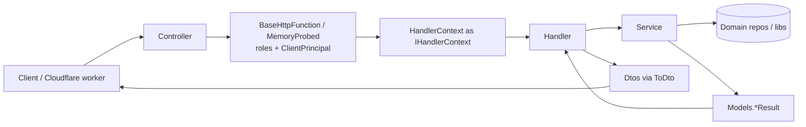

# Cloud/Api — architecture

Azure Functions HTTP API for Cult Podcasts curation and related operations (`api-infra`). Controllers are thin entry points; business work lives in services; JSON contracts are mapped at the handler edge.

**Audience:** engineers and agents adding or changing API endpoints.

**Related:** [folder = namespace ADR](../../docs/adr/0001-folder-equals-namespace.md) · [Discovery Curation API](../../docs/discovery-curation-api.md) · PR [#911](https://github.com/cultpodcasts/RedditPodcastPoster/pull/911) (handler/service split)

---

## Design principles

| Principle | Detail |
| --------- | ------ |
| **Controller wires HTTP only** | Route, auth roles, deserialize body/query, call `HandleRequest` → handler. No business logic, no Cosmos, no `ToDto`. |
| **Handler maps outcomes to HTTP** | Receives `IHandlerContext` + model + `CancellationToken`. Calls one service method, switches on `*Status` / `*Result`, returns responses via `ctx.Ok` / `ctx.NotFound` / … and `.ToDto()` for bodies. Does not take `HttpRequestData` or `ClientPrincipal`. |
| **Service owns use-case logic** | Returns `Api.Models` result/outcome types (and domain entities). **Must not** reference `Api.Dtos`, construct response DTOs, or touch `HttpResponseData`. |
| **Models = internal + request shapes** | `*ChangeRequest`, `*Command`, wrappers, `*Result` / `*Outcome` / status enums. Mutation JSON bodies bind to Models (same pattern as `EpisodeChangeRequest`). |
| **Dtos = response (and rare wire) JSON** | `*Dto`, response envelopes, `ApiErrorResponse`. Mapping lives in `Dtos/Extensions` (and `Dtos/Mapping` for non-trivial maps). |
| **Folder = namespace** | `Controllers/PersonController.cs` → `Api.Controllers`. `Handlers/People/…` → `Api.Handlers.People`. Same for `Services/{Area}/`. See ADR 0001. |
| **One verb, one handler, one service** | Prefer `GetPersonHandler` + `IPersonGetService` over multi-verb god types. |
| **IHandlerContext at the HTTP edge** | `BaseHttpFunction` builds concrete `HandlerContext` from `HttpRequestData` + principal after auth. Handlers depend only on `IHandlerContext` (`Subject`, `Query`, status helpers). Cancellation tokens stay as separate `Handle` parameters — not on the context. |

---

## Request flow



1. **Controller** — `[Function]`, route, `[FromBody]` Models request (when mutating), required roles (`curate`, `admin`, `publish`, …).
2. **Auth base** — `HandleRequest` / `HandlePublicRequest` enforce principal and roles; memory probe wraps execution; constructs `HandlerContext` and passes `IHandlerContext` to the handler.
3. **Handler** — `service.XAsync(...)` → `switch (result.Status)` → `ctx.Ok` / `ctx.NotFound` / `ctx.InternalError(...)`.
4. **Service** — load/apply/persist via class libraries; return typed result (never DTOs).
5. **Handler edge** — `entity.ToDto()` or outcome `.ToDto()` into `ctx.Ok` / `ctx.Accepted`; failures use `ApiErrorResponse.Failure(...)` via `ctx.InternalError`.

### Exemplar: GET person

```
PersonController.Get
  → GetPersonHandler.Handle(ctx, personName, ct)
      → IPersonGetService.GetAsync → PersonGetResult
      → Ok      → await ctx.Ok(person.ToDto(), ct)     // PersonDto
      → NotFound → ctx.NotFound()
      → Failed  → await ctx.InternalError(ApiErrorResponse.Failure(...), ct)
```
### Exemplar: PATCH/POST person

```
PersonController.Post
  → [FromBody] PersonChangeRequest          // Models
  → PersonChangeRequestWrapper
  → PostPersonHandler → IPersonUpdateService
      → PersonChangeApplier.Apply(entity, change)  // Models only
      → PersonUpdateResult
  → handler maps status → HTTP (no DTO until response if returning entity)
```

---

## Folder layout

```
Cloud/Api/
├── Controllers/            Azure Functions entry (namespace Api.Controllers)
├── BaseHttpFunction.cs     Auth + role gates (namespace Api)
├── MemoryProbedHttpBaseClass.cs
├── Ioc.cs                  Composition root — calls AddApi{Area}() helpers
├── Configuration/          HostingOptions, etc.
├── Factories/              ClientPrincipal factory, etc.
├── Resolvers/              e.g. PodcastEpisodeResolver
├── Extensions/             HTTP helpers + ApiAreaServiceCollectionExtensions (DI)
├── Handlers/
│   ├── IHandlerContext.cs / HandlerContext.cs   HTTP edge for handlers (Subject, Query, status helpers)
│   └── {Area}/         Api.Handlers.{Area} — status → HTTP + ToDto
├── Services/{Area}/        Api.Services.{Area} — use cases, appliers (IService + Service split files)
├── Models/                 Requests, commands, results, outcomes
├── Dtos/                   Response JSON types
│   ├── Extensions/         ToDto() for domain → Dto and outcome → response
│   └── Mapping/            Heavier mappers (e.g. EpisodeDiscreteMapper)
└── architecture.md         This document
```

### Areas (Handlers and Services stay in sync)

| Area | Typical controllers |
| ---- | ------------------- |
| `Episodes` | `EpisodeController`, `PublishController` (episode publish) |
| `Podcasts` | `PodcastController` |
| `People` | `PersonController` |
| `Subjects` | `SubjectController` |
| `Public` | `PublicController` |
| `Discovery` | `DiscoveryCurationController` |
| `DiscoverySchedule` | `DiscoveryScheduleController` |
| `SubmitUrl` | `SubmitUrlController` |
| `Terms` | `TermsController` |
| `PushSubscriptions` | `PushSubscriptionController` |
| `Homepage` | `PublishController` (homepage) |
| `SearchIndex` | `SearchIndexController` |

---

## Models vs Dtos

| Kind | Namespace | Examples | Bound from HTTP? | Returned as JSON? |
| ---- | --------- | -------- | ---------------- | ----------------- |
| Change / create body | `Api.Models` | `EpisodeChangeRequest`, `PersonChangeRequest`, `PodcastChangeRequest`, `SubjectChangeRequest` | Yes (`[FromBody]`) | Only if you deliberately echo it (prefer `*Dto` for GET) |
| Command / wrapper | `Api.Models` | `PodcastRenameCommand`, `EpisodePublishRequestWrapper`, `PersonChangeRequestWrapper` | Wrapper built in controller | No |
| Result / outcome | `Api.Models` | `PersonGetResult`, `EpisodeUpdateOutcome`, status enums | No | No — handler maps them |
| Response DTO | `Api.Dtos` | `PersonDto`, `PodcastDto`, `SubjectDto`, `DiscreteEpisodeDto`, `PublicEpisodeDto` | No | Yes via `ToDto` |
| Error envelope | `Api.Dtos` | `ApiErrorResponse` | No | Yes on failure paths |
| Submit-url success shape | `Api.Dtos` | `SubmitUrlResponse` | No | Yes — **only** submit-url flow (do not reuse as generic error) |

**Naming rule:** never put a type named `Person`, `Podcast`, `Subject`, or bare `Episode` in `Api.Dtos` or `Api.Models` — those collide with `RedditPodcastPoster.Models.*` and break aliases. Use `PersonDto` / `PersonChangeRequest` (and likewise for Podcast/Subject).

**DTO naming (exemplary):**
- Top-level JSON entity roots → `*Dto` (`DiscreteEpisodeDto`, `PublicEpisodeDto`, `IndexerStateDto`).
- Top-level verb/outcome envelopes → `*Response` (`EpisodeUpdateResponse`, `IndexPodcastResponse`).
- Nested members of a single root → inner types **without** a `Dto` suffix (`DiscoveryResponse.Item`, `IndexPodcastResponse.IndexedEpisode`, `DiscreteEpisodeDto.PersonMatch`, `SubmitUrlResponse.ItemState`).
- Shared nested enums used by several roots → sibling file, no `Dto` suffix (`SearchIndexerState`).
- Prefer flat projections over inheriting domain entities (especially `Episode`).
- Never put `Dto` on a type that is only nested under another JSON root.

**Rename:** wire JSON for rename body is `Api.Dtos.PodcastRenameRequest`; internal command is `Api.Models.PodcastRenameCommand`.

---

## Layer rules (checklist)

### Controllers

- [ ] Import only the handler area(s) you call (`using Api.Handlers.People;` — not every area).
- [ ] Do not import a non-existent `Api.Handlers` namespace (types live in nested areas).
- [ ] Deserialize mutations to **Models** change-request types.
- [ ] Pass thin wrappers (`*RequestWrapper`) into handlers when route ids + body must travel together.

### Handlers

- [ ] Depend on `I{Area}{Verb}Service` (or equivalent), not repositories directly (unless a rare pure map with no I/O).
- [ ] Signature: `Handle(IHandlerContext ctx, …, CancellationToken ct)` — never `HttpRequestData` / `ClientPrincipal`.
- [ ] Exhaustive `switch` on status; unexpected → log + `ctx.InternalError(ApiErrorResponse.Failure(...), ct)`.
- [ ] Response mapping: `using Api.Dtos.Extensions;` and `.ToDto()` into `ctx.Ok` / `ctx.Accepted`.
- [ ] Use `ctx.Subject` / `ctx.Query(...)` only when needed (most handlers ignore subject; auth already ran).
- [ ] Keep orchestration light; query parsing and batch mapping belong in services / `Dtos/Mapping` (handlers stay status→HTTP).

### Services / appliers

- [ ] **No** `using Api.Dtos` (or Dto types) in `Services/`.
- [ ] Accept `*ChangeRequest` / commands / wrappers from Models; apply onto domain entities (`PersonChangeApplier`, `PodcastChangeApplier`, `SubjectChangeApplier`, `EpisodeChangeApplier`).
- [ ] Return `*Result` / `*Outcome` records with a status enum.

### Dtos / mapping

- [ ] Prefer `Dtos/Extensions/*Extension.cs` for `ToDto`.
- [ ] Use `Dtos/Mapping/` when mapping needs DI (e.g. `EpisodeDiscreteMapper`).
- [ ] Keep `[JsonPropertyName]` stable when renaming CLR types (`Person` → `PersonDto`).

---

## Adding a new endpoint

1. **Decide the area** (or add `Handlers/NewArea` + `Services/NewArea` with matching namespaces).
2. **Models** — request body (if any) as `*ChangeRequest` or command; `*Result` + status enum for the service return.
3. **Service** — `IFooService` + `FooService` as separate files in `Services/{Area}/`; register via `AddApi{Area}()` in `Extensions/ApiAreaServiceCollectionExtensions.cs` (wired from `Ioc.cs`).
4. **Handler** — `IFooHandler` + `FooHandler` in `Handlers/{Area}/`; map status → HTTP + `ToDto` / `ApiErrorResponse`.
5. **Dto** (if new response shape) — `Dtos/FooDto.cs` + `ToDto` extension in `Dtos/Extensions/` (no static factories on DTO types).
6. **Controller** — one method under `Controllers/` (`Api.Controllers`): roles + `HandleRequest(..., handler.Handle, ...)`.
7. **Tests** — at least: service status cases and/or handler status→HTTP matrix (see below).

---

## Auth and hosting

| Concern | Where |
| ------- | ----- |
| Role gates | `BaseHttpFunction.HandleRequest` — roles passed per action (`curate`, `admin`, `publish`, …) |
| Public-but-authenticated | `HandlePublicRequest` (e.g. public episode) — principal required, no curate role |
| Easy Auth / Auth0 principal | `IClientPrincipalFactory` |
| Memory probe | `MemoryProbedHttpBaseClass` + `IMemoryProbeOrchestrator` |
| DI | `Ioc.cs` — domain `Add*` extensions, then `AddApiEpisodes()` / `AddApiPeople()` / … area helpers |

Production deploy is by **script** (blob + restart), not inferred from CI — see repo deploy-truth rules / `docs/deployment.md`.

---

## Testing

Tests live under `Cloud/Unit-Tests/FunctionHost.Tests/Api/`:

| Focus | Example |
| ----- | ------- |
| Handler status → HTTP | `Handlers/HandlerStatusMatrixTests.cs`, `Handlers/ThinHandlerTests.cs` |
| Service results | `Services/*Tests.cs`, `EpisodeDeleteServiceTests.cs` |
| Pure appliers | `EpisodeChangeApplierTests.cs` (in-memory entity, no Cosmos) |
| Controller auth | `Controllers/PublicControllerAuthTests.cs`, `EpisodeControllerAuthTests.cs` |
| DI smoke | `ApiIocTests.cs` — resolves handler entry points |

```powershell
dotnet test Cloud/Unit-Tests/FunctionHost.Tests/FunctionHost.Tests.csproj --filter "FullyQualifiedName~Api"
```

Prefer mocking `IMemoryProbeOrchestrator.Start` → `IMemoryProbeScope` when exercising memory-probed controllers.

**Do not** write production Cosmos episode documents from tests or agents without explicit approval (see episode guest-handles guardrail).

---

## Anti-patterns

| Avoid | Prefer |
| ----- | ------ |
| Fat multi-verb handler | One handler + one service per verb |
| `HttpResponseData` in `Services/` | Return `*Result`; handler maps HTTP |
| `HttpRequestData` / `ClientPrincipal` on handlers | `IHandlerContext` (+ separate `CancellationToken`) |
| `CancellationToken` on `IHandlerContext` | Keep CT as a `Handle` parameter; pass into `ctx.Ok(body, ct)` |
| `new PersonDto { ... }` inside a service | Return domain entity; handler `.ToDto()` |
| Inheriting domain `Episode` for API JSON | Flat `DiscreteEpisodeDto` projection |
| Top-level entity DTO without `*Dto` suffix | `PublicEpisodeDto`, `IndexerStateDto`, … |
| Shared nested type forced inner on one root | Sibling file when several roots use it |
| `SubmitUrlResponse.Failure` for unrelated APIs | `ApiErrorResponse.Failure` |
| `Api.Dtos.Person` / bare `Person` as both GET and PATCH type | `PersonDto` + `PersonChangeRequest` |
| `using Api.Handlers;` + every area on every controller | Only the areas you use |
| Putting response types in `Api.Models` with domain names | Causes namespace shadowing; keep responses in `Dtos` with `*Dto` suffix |
| Inferring prod deploy/runtime from CI or traces alone | Deploy blob + `AppRequests` (repo guardrails) |

---

## Key source files

| Area | Path |
| ---- | ---- |
| Composition | `Ioc.cs`, `Extensions/ApiAreaServiceCollectionExtensions.cs` |
| Controllers | `Controllers/*Controller.cs` (`Api.Controllers`) |
| Auth base | `BaseHttpFunction.cs`, `MemoryProbedHttpBaseClass.cs` |
| Handler HTTP edge | `Handlers/IHandlerContext.cs`, `Handlers/HandlerContext.cs` |
| Person GET exemplar | `Handlers/People/GetPersonHandler.cs`, `Services/People/PersonGetService.cs` |
| Person mutate | `Models/PersonChangeRequest.cs`, `Services/People/PersonChangeApplier.cs` |
| Episode mutate | `Models/EpisodeChangeRequest.cs`, `Services/Episodes/EpisodeChangeApplier.cs` |
| Response mapping | `Dtos/Extensions/PersonExtension.cs`, `Dtos/Mapping/EpisodeDiscreteMapper.cs` |
| Errors | `Dtos/ApiErrorResponse.cs` |
| HTTP JSON helper | `Extensions/ResponseExtensions.cs` |
