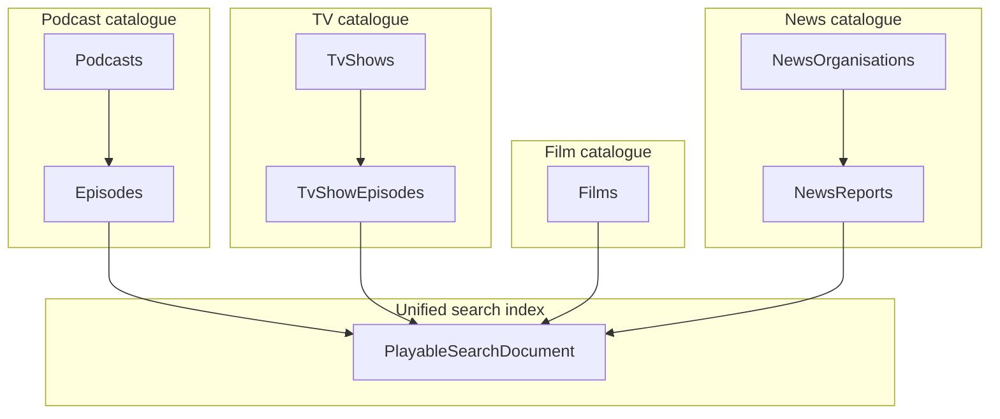

# Catalogue content types epic (planning)

**Status:** Phase 0 — **sign-off complete 2026-09-23** (quiz OPEN-001…012 + CLS). Not scheduled for implementation.  
**Purpose:** rock-solid product + architecture contract for splitting podcast, TV, film (one-off documentary), and news — without breaking today’s catalogue, search, or submit flows.

**Supersedes (terminology):** earlier drafts used **Movie** / `/movie/` / `movieName`. **Do not use those names.** Product type is **Film**.

| Artifact | Path | Status |
|----------|------|--------|
| ADR — separate containers | [adr/0002-separate-catalogue-content-containers.md](./adr/0002-separate-catalogue-content-containers.md) | **Accepted** 2026-09-23 |
| ADR — unified search shape | [adr/0003-unified-playable-search-document.md](./adr/0003-unified-playable-search-document.md) | **Accepted** 2026-09-23 |
| ADR outline — scraper classification | [adr/0004-scraper-content-classification-outline.md](./adr/0004-scraper-content-classification-outline.md) | CLS-001…008 signed (Phase 3 still validates against live scrapers) |
| Search storage impact | [catalogue-content-types-search-storage-impact.md](./catalogue-content-types-search-storage-impact.md) | Planning; re-measure before Phase 2 |

---

## Glossary (authoritative)

| Term | Meaning |
|------|---------|
| **Podcast** | Audio/video show (Spotify / Apple / YouTube **entertainment** channels). Parent → Episode. |
| **TvShow** | Traditional multi-episode **series** (BBC iPlayer, Netflix series, etc.). **Not** YouTube entertainment “shows”. |
| **TvShowEpisode** | One episode of a TvShow. Own Cosmos container. |
| **Film** | Standalone work **made as a film** (one-off). Premiere venue irrelevant — cinema or one-off TV. Examples: *Going Clear*, *My Scientology Movie*, *A Very British Cult*. Standalone playable — **no parent**. Product name is **Film**, not Movie. |
| **NewsOrganisation** | News outlet (e.g. BBC News, Sky News, 4-letter TV news stations). |
| **NewsReport** | One report belonging to a NewsOrganisation. Own Cosmos container. |
| **`contentKind`** | Search/API facet on the **playable instance**: `Episode \| TvShowEpisode \| Film \| NewsReport`. |
| **`shortId`** | URL-safe base64url payload: Podcast = 16-byte GUID; Film/TV/News = ASCII `f`\|`t`\|`n` + 16-byte GUID (same encoding on **routes and shortener**). See OPEN-003. |
| **Slug** | SEO path segment derived from title/name; **ignored for resolve**; optional soft-correct redirect if stale. |

**Provider vs product:** scrapers and JSON-LD often say `@type: Movie` / `IsMovie`. That is a **classification input**. Persisted catalogue type and routes use **Film**, never Movie.

---

## Problem

Today **all ingestible URLs** that are not Spotify / Apple / YouTube podcast-service episodes are folded into **Podcast + Episode**:

- Streaming submit creates or attaches a **Podcast** from scraped “show” metadata (`NonPodcastShowNameResolver`, `PodcastNameAttachLookup`).
- A Netflix one-off, a BBC iPlayer drama series episode, and a long-running audio show can all become rows in **Podcasts** with children in **Episodes**.
- Azure AI Search is a **single episode-shaped index** keyed by episode id, with **`podcastName`** as the parent label — no content-kind facet.

**Much of the corpus is already mis-filed** and must be **identified and migrated** (tools incremental; dry-run default; `--apply` only with explicit approval):

| Real-world content | Current storage | Target |
|--------------------|-----------------|--------|
| Audio / video podcast; YouTube **entertainment** channels | Podcast + Episode | **Stay** |
| Traditional TV **series** | Podcast + Episode | **TvShows** + **TvShowEpisodes** |
| **One-off film** (cinema or TV; made as a film) | Podcast + Episode | **Films** |
| **News** outlet + reports (incl. **news-station YouTube** channels stored as Podcasts) | Podcast + Episode | **NewsOrganisations** + **NewsReports** |
| BBC `/news/` web URLs | Not submit today | Future ingest only |

---

## Decisions locked (2026-09-23 sign-off quiz)

| ID | Decision |
|----|----------|
| **S-001** | Product type **Film** (container `Films`, `contentKind: Film`). No Movie naming in product/API/routes. |
| **S-002** | Film = standalone work **made as a film** (one-off); cinema vs TV premiere **irrelevant**. **No parent**; **no** parent-name field. See OPEN-001 resolved. |
| **S-003** | Public Film URL: `/film/{slug}/{shortId}`. `shortId` = base64url(`f` + GUID bytes). Cosmos keeps GUID. |
| **S-004** | Cosmos containers + partition keys as ADR-0002 (incl. Films `/id`). |
| **S-005** | When `contentKind` filter **omitted**: return **all kinds**. Website cards **must** branch by `contentKind` from the first non-podcast docs. |
| **S-006** | Migrate **preserves playable GUID**; search **swap** (`contentKind` + parent fields). Id **fallback**: resolve by GUID across playable containers / search if kind/route unknown. |
| **S-007** | Migration order: **News → Film → TV**. |
| **S-008** | News-station identify: **allowlist-only** for `--apply`; heuristics for **dry-run candidate discovery** only. |
| **S-009** | Single-episode → **Film**; miniseries / anthology / finite or ongoing series → **TvShow** + **TvShowEpisode**s (OPEN-006). |
| **S-010** | Public routes: Film as S-003; TV `/tv/{tv-show-slug}` and `/tv/{tv-show-slug}/{shortId}`; News `/news/{news-org-slug}` and `/news/{news-org-slug}/{shortId}`; podcast paths unchanged; migrated rows **redirect** old episode URL → new kind route. |

---

## Challenged / revisit (do not paper over)

These came up when re-reading 2026-09-03 drafts against 2026-09-23 intent. **Resolve before or during the named phase** — do not assume the old draft was right.

### OPEN-001 — Film scope — **RESOLVED 2026-09-23**

**Decision:** A **Film** is a standalone work **made as a film** by its producers. **Where it premiered first does not matter** (cinema or one-off TV).

| In (examples) | Out |
|---------------|-----|
| *Going Clear*, *My Scientology Movie* (cinema docs) | Episodes of an ongoing **series** → TvShowEpisode |
| *A Very British Cult* (one-off TV documentary) | YouTube entertainment “shows” → Podcast |
| Other one-offs conceived/produced as a film | Multi-episode series shells |

**Classifier implication:** provider `Movie` / one-off / feature / special signals that mean “standalone film production” → **Film**. Series watch URLs → TvShow. Premiere venue must not drive the type. Edge fiction one-offs that are genuinely made-as-films are Film; serialised drama is not.

### OPEN-002 — Parent routes are slug-only — **RESOLVED 2026-09-23**

**Decision:** Keep **slug-only** parent hubs (`/tv/{slug}`, `/news/{slug}`), same as `/podcast/{name}`. Renames use the existing **Cloudflare redirect list** (same operational pattern as rename-podcast). Soft-correct in-app remains optional sugar.

Playables stay `{slug}/{shortId}` so the GUID-derived id survives title edits without a CF entry.

### OPEN-003 — Shortener / route `shortId` kind prefix — **RESOLVED 2026-09-23**

**Decision:** Film / TV / News public `shortId`s (routes **and** shortener) encode **kind + GUID**, then base64url (same alphabet as today’s `GuidService.toBase64`).

| Kind | Prefix byte (ASCII) | Payload before base64 |
|------|---------------------|------------------------|
| Film | `f` | `f` + 16-byte GUID |
| TvShowEpisode | `t` | `t` + 16-byte GUID |
| NewsReport | `n` | `n` + 16-byte GUID |
| Podcast (Episode) | *(none)* | 16-byte GUID only — **legacy + ongoing** for podcast shares/routes |

**Expand:** base64url-decode → if length 17 and first byte ∈ `{f,t,n}`, strip prefix → kind + GUID; if length 16 → treat as **Podcast** episode GUID (existing shortener keys keep working).

**Routes** use the same `shortId` as the shortener for consistency, e.g. `/film/{slug}/{shortId}` where `shortId` is the `f`-prefixed encoding. Path prefix (`/film/`, `/tv/`, `/news/`) remains for SEO/UX; kind in `shortId` supports fallback when path is wrong or missing.

**Migrate:** old podcast-style short links (16-byte) for a GUID that moved to Film still resolve via **id fallback** (S-006); new shares after migrate use the prefixed form.

**Implementation note:** extend Guid↔shortId helpers in website + Api Worker together; do not invent a second alphabet.

### OPEN-004 — Unified search projection fields — **RESOLVED 2026-09-23**

**Decision:** Project all playables into a **shared search-item model** (do **not** keep `episodeTitle` / `podcastName` as the long-term public shape):

| Field | Episode | TvShowEpisode | Film | NewsReport |
|-------|---------|---------------|------|------------|
| `title` | episode title | episode title | film title | headline |
| `seriesName` | podcast name | tv show name | **null / omit** | news organisation name |
| `description` | episode description | episode description | film description | report description |
| `seriesDescription` | podcast description (join) | tv show description (join) | **null / omit** | organisation description (join) |

Plus existing cross-cutting fields as needed (`contentKind`, `id`, `release`, `subjects`, `lang`, `svc`, …).

**Film:** no series — `seriesName` / `seriesDescription` empty (same as no parent in Cosmos).

**Cutover (storage):** Build a **fresh index** with the new projection (+ any remaining slimming) — epic OPEN-011. Plan SKU bump or delete-rebuild downtime. Facet/filter uses **`seriesName`** (Film docs omit). Legacy `episodeTitle` / `podcastName` / `episodeDescription` die with the old index.

**Note:** `seriesDescription` is **new** indexed text (parent join) — not on today’s episode search doc. Truncate like description; re-measure quota after backfill (OPEN-007).

### OPEN-005 — `contentKind` for TV playables — **RESOLVED 2026-09-23**

**Decision:** An instance of a TV show (the indexed/playable row) has **`contentKind: TvShowEpisode`** — not `TvShow`.

(`TvShow` remains the **parent** Cosmos type / hub route only.)

### OPEN-012 — `contentKind` for podcast playables — **RESOLVED 2026-09-23**

**Decision:** Podcast playables are Cosmos **Episodes**. Search/API **`contentKind: Episode`** (not `Podcast`).

Facet / enum: **`Episode | TvShowEpisode | Film | NewsReport`**.

(`Podcast` remains the **parent** Cosmos type / hub route only — same pattern as TvShow vs TvShowEpisode.)

### OPEN-006 — Miniseries / single-episode / anthology — **RESOLVED 2026-09-23**

**Decision:**

| Shape | Catalogue |
|-------|-----------|
| **Single-episode** (one programme / one-shot) | **Film** |
| **Miniseries** (incl. finite) | **TvShow** + **TvShowEpisode**s |
| **Anthology** | **TvShow** + **TvShowEpisode**s |
| Ongoing series | **TvShow** + **TvShowEpisode**s |

A miniseries is **not** a Film. Multi-episode structure → TV; one standalone episode/programme → Film (aligned with OPEN-001 made-as-film).

### OPEN-007 — Live search quota baseline — **RESOLVED 2026-09-23**

**Decision:** Proceed on **existing estimates** for planning. **Re-measure** `documentCount` + `storageSize` **during Phase 2 implementation** (not a hard gate before design). Still avoid dual full indexes on Free tier.

### OPEN-008 — NewsOrganisation vs NewsReport fields — **RESOLVED 2026-09-23**

**Note (CLS-004):** Phase 3/migration investigation should characterise typical **USA news-network channel names** (and similar) as an assist for outlet detection — never sole authority for `--apply` without allowlist/curator (S-008).

### OPEN-009 — Social posting per kind — **RESOLVED 2026-09-23**

**Decision:** **Per-kind posting templates** (Bluesky / etc.) are **required before Film / News / TV playables go public** (or are included in outgoing social). Podcast posting stays as today until those templates exist. Not optional cleanup — gate public multi-kind surfacing for social.

### OPEN-010 — Curator permissions per kind — **RESOLVED 2026-09-23**

**Decision:** Same Auth0 **`curate`** / Curator (and **`submit`** where applicable) for **all** catalogue kinds initially. No split roles in this epic.

### OPEN-011 — Search index cutover strategy — **RESOLVED 2026-09-23**

**Decision:** Prefer a **fresh index** that combines any remaining slimming deltas with the new playable projection (`contentKind`, `title`, `seriesName`, `description`, `seriesDescription`, …). Plan **SKU bump** or **delete-rebuild downtime** — do not rely on dual full indexes fitting Free tier. Measure live size during Phase 2 (OPEN-007) to pick SKU vs downtime.

---

## Decision (architecture)

**Separate Cosmos containers per content family**, not a type discriminator on Podcast/Episode.

| Container | Partition key | Parent → child |
|-----------|---------------|----------------|
| **Podcasts** (existing) | `/id` | → **Episodes** `/podcastId` |
| **TvShows** (new) | `/id` | → **TvShowEpisodes** (own container) `/tvShowId` |
| **Films** (new) | `/id` | — (document **is** the playable) |
| **NewsOrganisations** (new) | `/id` | → **NewsReports** (own container) `/newsOrganisationId` |

**TvShowEpisode** and **NewsReport** must never live in Episodes. News must never be stored as TvShow or Podcast. Film has no parent container.

YouTube **entertainment** stays **Podcast**. **News-station** YouTube channels already in Podcasts are **NewsOrganisation** migration candidates (S-007, S-008).

---

## Target architecture

### Search `contentKind` (playable rows only)

| `contentKind` | Cosmos source | `title` | `seriesName` | `seriesDescription` |
|---------------|---------------|---------|--------------|---------------------|
| `Episode` | Episodes | episode title | podcast name | podcast description (join) |
| `TvShowEpisode` | TvShowEpisodes | episode title | tv show name | tv show description (join) |
| `Film` | Films | film title | **omit** | **omit** |
| `NewsReport` | NewsReports | headline | news organisation name | org description (join) |

Also project `description` (playable blurb) on all kinds. Parents are **not** separate search rows.

**Default query (S-005):** omitted `contentKind` → **all kinds**.

Legacy index keys (`episodeTitle`, `podcastName`, `episodeDescription`) are **retired** after clients switch (OPEN-004 cutover).

### Public routes (S-003, S-010)

| Surface | Path | Resolve key |
|---------|------|-------------|
| Film playable | `/film/{slug}/{shortId}` | `shortId` = base64url(`f`+GUID) |
| TvShow hub | `/tv/{tv-show-slug}` | slug → TvShow (CF redirects on rename) |
| TvShowEpisode | `/tv/{tv-show-slug}/{shortId}` | `shortId` = base64url(`t`+GUID) |
| NewsOrganisation hub | `/news/{news-org-slug}` | slug → NewsOrganisation (CF redirects on rename) |
| NewsReport | `/news/{news-org-slug}/{shortId}` | `shortId` = base64url(`n`+GUID) |
| Podcast | existing podcast/episode paths | unchanged; episode shortener stays **unprefixed** GUID base64url |

Slug is never authoritative. Optional 301 when slug ≠ current slug for that id.

### Service URLs

Reuse Episode **`services` map** on TvShowEpisode, Film, and NewsReport ([episode-services.md](./episode-services.md)). Catalog keys stay aligned with website `service-catalog.ts`.

---

## Current state (baseline)

### Cosmos

- Podcasts + Episodes (detached); episodes partition by podcast id.
- Episodes carry `services` + platform ids.

### Submit / lookup

- Membership on **Episodes** only; streaming may return scraped `podcastName`.
- BBC submit: `/sounds/play/` and `/iplayer/episode/` only — **not** `/news/`.

### Search

- `EpisodeSearchRecord`-shaped index; facets `podcastName`, `subjects`, `lang`.
- Jul 2026 baseline ~82k / ~49 MB Free — **re-measure** (OPEN-007).

### Auth

- Submit: `submit` / Submitter; curation: `curate` / Curator. Same permissions for all kinds initially (split roles deferred).

---

## Migration (first-class)

| Mis-filed as | Target | Identify |
|--------------|--------|----------|
| News-station YouTube Podcast (+ episodes) | NewsOrganisation + NewsReports | **Allowlist** for apply; heuristics for dry-run only (S-008) |
| One-off film (cinema or TV) Podcast/Episode | Film | Streaming film / one-off URLs + curator review |
| Series-shaped Podcast/Episodes | TvShow + TvShowEpisodes | Series URLs / metadata |

**Principles**

1. Dry-run by default; `--apply` only with explicit approval.  
2. Incremental tools per family; order **News → Film → TV** (S-007).  
3. Move, don’t copy; search **swap**; **preserve GUID** (S-006).  
4. Idempotent / resumable; no silent agent production writes.  
5. After apply: old episode URLs **redirect**; shortener/page-details kind-aware (OPEN-003).

---

## Submit URL flows (future — Phase 3)

| URL class | Today | Target |
|-----------|-------|--------|
| Spotify / Apple / YouTube episode | Episode | Episode |
| BBC / Netflix / Prime **series episode** | Podcast + Episode | TvShow + TvShowEpisode |
| One-off film (cinema or TV) / provider film | Podcast + Episode | **Film** |
| YouTube entertainment | Podcast + Episode | Podcast + Episode |
| YouTube news-station | Podcast + Episode | NewsOrganisation + NewsReport (migrate first; submit later) |
| BBC **News** | Not submit | NewsOrganisation + NewsReport (new matcher) |

Lookup: membership across playable containers; name attach per parent kind with **podcast-like parent-name UI** (esp. TvShow when episodes come from different YouTube/Vimeo/BBC channels — CLS-005); response **`parentName` + `contentKind` hint** (Film: title only, no parent). Feature-flagged; fallback Podcast+Episode until flag on.

---

## API & website

| Layer | Change |
|-------|--------|
| **api-infra** | CRUD + submit per container; search DTO `contentKind` + kind fields |
| **Api Worker** | Proxy routes; search passthrough; **page-details / shortener kind-aware** (OPEN-003) |
| **Website** | Cards by `contentKind`; routes per S-010; Film has no parent line |
| **Indexer / Bluesky** | **Per-kind templates required** before non-podcast kinds are publicly posted (OPEN-009) |

---

## Options considered

| Option | Verdict |
|--------|---------|
| Type discriminator on Podcast/Episode only | **Rejected** — children/lifecycles don’t fit |
| Separate containers | **Chosen** |
| Hybrid: new submits only, never migrate | **Rejected** — corpus already wrong |
| Separate search indexes per kind | **Rejected** — Free-tier quota |
| Product name Movie / `/movie/` | **Rejected** 2026-09-23 — use **Film** |
| Generic `parentName` on all rows incl. Film | **Rejected** — Film has no parent; don’t duplicate `podcastName` |

---

## Epic phases

### Phase 0 — Design & ADR

- [x] ADRs 0002 / 0003 + storage impact + 0004 outline  
- [x] Sign-off quiz 2026-09-23 (S-001…S-010)  
- [x] Resolve OPEN-001…OPEN-012 (2026-09-23 quiz + follow-ups)  
- [x] AGENTS.md links (keep in sync with Film naming)

### Phase 1 — Schema & persistence (no user-facing switch)

- Cosmos: TvShows, TvShowEpisodes, Films, NewsOrganisations, NewsReports + repositories  
- Models mirror Episode `services` where applicable  
- Unit tests; **no** production writes  

### Phase 2 — Search index

- In-place `contentKind` + kind parent fields (none for Film)  
- Indexer from four playable sources  
- **No dual full indexes on Free tier** without SKU bump  
- Clients handle all kinds when filter omitted (S-005)  

### Phase 3 — Submit / lookup v2

- Classify URL → kind (ADR-0004 complete; OPEN-001 resolved — made-as-film)  
- Lookup all playable containers; feature flag to new containers  

### Phase 4 — UI & curation

- Facet UI; detail routes S-010; shortener/page-details kind-aware (OPEN-003)  
- **Parent-name UI** for TvShow (and NewsOrganisation) attach — same idea as podcast series picker when building a series from many channels (CLS-005)  
- News submit matcher (not TV)  
- Per-kind social templates before public non-podcast posting (OPEN-009)  

### Phase 5 — Migration tooling (interleaved as containers land)

- Dry-run + allowlisted `--apply` for News, then Film, then TV  
- Search swap; redirects; deprecate “streaming/news as podcast” metrics  

---

## Explicit non-goals

- Internet Archive streaming expand (unless decided later).  
- Recategorising **all** YouTube as TvShow.  
- Merging NewsReports into Episodes/TvShowEpisodes; reports without NewsOrganisation.  
- Big-bang unattended Cosmos migration.  
- Product/API use of **Movie** naming.  
- Indexing NewsOrganisations / TvShows / Podcasts as search rows.  

---

## Open questions (remaining)

| # | Topic | Notes |
|---|-------|--------|
| OPEN-001 | Film scope | **Resolved** — made-as-film; cinema vs TV premiere irrelevant |
| OPEN-002 | Parent shortId in paths? | **Resolved** — slug-only; renames via CF redirect list (same as podcast) |
| OPEN-003 | Shortener / page-details kind awareness | **Resolved** — `f`/`t`/`n` + GUID → base64url on routes + shortener; podcast stays unprefixed |
| OPEN-004 | Search title/parent field names | **Resolved** — project `title`, `seriesName`, `description`, `seriesDescription` (Film: no series*) |
| OPEN-005 | Facet value for TV playables | **Resolved** — `contentKind: TvShowEpisode` |
| OPEN-012 | Facet value for podcast playables | **Resolved** — `contentKind: Episode` |
| OPEN-006 | Miniseries / single-ep / anthology | **Resolved** — single-episode → Film; mini/anthology/finite series → TvShow + episodes |
| OPEN-007 | Re-measure search storage | **Resolved** — measure during Phase 2 impl; planning uses estimates |
| OPEN-008 | NewsOrganisation vs report field model | **Resolved** — lock parent/playable only; detailed fields in Phase 1 model PR |
| OPEN-009 | Social posting per kind | **Resolved** — per-kind templates required before Film/News/TV go public on social |
| OPEN-010 | Split curator roles per kind? | **Resolved** — same `curate` / `submit` for all kinds initially |
| OPEN-011 | Slimming + content-types cutover | **Resolved** — fresh index combining slimming + new projection; SKU bump or delete-rebuild |
| CLS-002 | Netflix `/title/` series hub | **Signed** — reject until episode/watch URL |
| CLS-003 | Vimeo | **Signed** — curator chooses when ambiguous |
| CLS-004 | News outlet resolution | **Signed** — scrape + name-attach; USA news-network heuristics assist; curator override |
| CLS-005 | Parent attach / series build-up | **Signed** — podcast-like parent-name UI + 0/1/many rules; critical for TvShow from many channels |

**Resolved 2026-09-23:** containers/PKs; Film naming & no parent; routes; search default all-kinds; preserve GUID + fallback; migration order; news allowlist; CLS-001 Film vs TvShow(1).

---

## Related docs

| Doc | Relevance |
|-----|-----------|
| [episode-services.md](./episode-services.md) | Multi-URL `services` map |
| [website submit-url-flows.md](../../website/cultpodcasts/docs/submit-url-flows.md) | Client submit/lookup (update when epic ships) |
| [website auth0-roles-and-permissions.md](../../website/cultpodcasts/docs/auth0-roles-and-permissions.md) | Gates |
| [search-index-slimming-plan.md](./search-index-slimming-plan.md) | Index change + 50 MB |
| [catalogue-content-types-search-storage-impact.md](./catalogue-content-types-search-storage-impact.md) | Quota |
| [adr/0002](./adr/0002-separate-catalogue-content-containers.md) · [0003](./adr/0003-unified-playable-search-document.md) · [0004](./adr/0004-scraper-content-classification-outline.md) | ADRs |

---

## Summary

**Podcasts**, **traditional TV**, **Films** (made-as-film one-offs, cinema or TV, no parent), and **news** live in **separate Cosmos containers**. Unified search facets on **`contentKind`**: `Episode | TvShowEpisode | Film | NewsReport`. Public URLs use **SEO slugs + kind-prefixed `shortId`** (`f`/`t`/`n` + GUID → base64url; podcast unprefixed). Divert new submits behind flags; **migrate** mis-filed corpus News → Film → TV with dry-run / allowlisted `--apply`.
