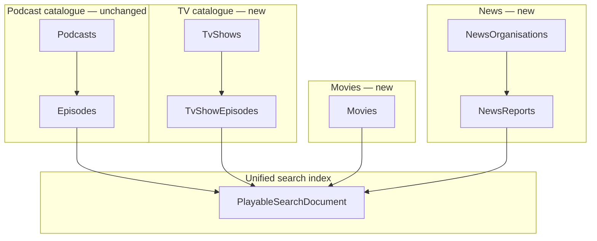

# Catalogue content types epic (planning)

**Status:** Phase 0 planning — not scheduled for implementation.  
**Purpose:** capture the intended split between podcast, TV, movie, and news content so we can scope a future epic without breaking today’s catalogue, search, or submit flows.

**Phase 0 deliverables (2026-09-03):**

| Artifact | Path |
|----------|------|
| ADR — separate containers | [adr/0002-separate-catalogue-content-containers.md](./adr/0002-separate-catalogue-content-containers.md) |
| ADR — unified search shape | [adr/0003-unified-playable-search-document.md](./adr/0003-unified-playable-search-document.md) |
| ADR outline — scraper classification | [adr/0004-scraper-content-classification-outline.md](./adr/0004-scraper-content-classification-outline.md) |
| Search storage impact analysis | [catalogue-content-types-search-storage-impact.md](./catalogue-content-types-search-storage-impact.md) |

## Problem

Today **all ingestible URLs** that are not Spotify / Apple / YouTube podcast-service episodes are folded into the **Podcast + Episode** Cosmos model:

- Streaming submit creates or attaches a **Podcast** row named from scraped “show” metadata (`NonPodcastShowNameResolver`, `PodcastNameAttachLookup`).
- A Netflix film, a BBC iPlayer drama episode, and a long-running audio show can all become rows in **Podcasts** with child rows in **Episodes**.
- Azure AI Search indexes a **single episode index** (`EpisodeSearchRecord`) keyed by episode id, with **`podcastName`** as the parent label and facets on `podcastName`, `subjects`, `lang` — not on content kind.

That works for audio-first curation but blurs product semantics. **Much of the corpus is already mis-filed** in Podcasts + Episodes and must be **identified and migrated** (tools built incrementally; dry-run default; `--apply` only with explicit approval):

| Real-world content | Current storage | Pain / migration |
|--------------------|-----------------|------------------|
| Audio / video podcast (Spotify, Apple, YouTube **entertainment / show** channels) | Podcast + Episode | Correct — **stays** |
| Traditional TV series (BBC iPlayer, Netflix **series**) | Podcast + Episode | Mis-filed — migrate → **TvShows** + **TvShowEpisodes** |
| Standalone **movie** | Podcast + Episode | Mis-filed — migrate → **Movies** |
| **News** outlet + reports (incl. **news-station YouTube channels** already stored as Podcasts) | Podcast + Episode | Mis-filed — migrate → **NewsOrganisations** + **NewsReports** |
| BBC `/news/` web URLs | Not submit today | Future ingest only; not the migration source for YouTube news channels |

We also want **search** to return playable items with the right parent identity (`podcastId` + name, `tvShowId` + name, `movieId` + name, `newsOrganisationId` + name for reports) and a **facet** so users can filter **Podcast | TvShow | Movie | NewsReport** without breaking existing podcast search.

## Decision (direction for epic)

**Use separate Cosmos containers per content family**, not a single container with a type discriminator.

| Container | Partition key (proposed) | Parent document | Child / playable document | Notes |
|-----------|--------------------------|-----------------|---------------------------|--------|
| **Podcasts** (existing) | `/id` | Podcast | **Episodes** (existing, `/podcastId`) | True podcasts + YouTube **entertainment** channels; **news-station / movie / TV** rows migrate out |
| **TvShows** (new) | `/id` | TvShow | **TvShowEpisodes** (new, **own container**, `/tvShowId`) | Traditional TV only — **not** YouTube “shows” |
| **Movies** (new) | `/id` | — | **Movies** (new) | Standalone feature; **multiple service URLs** per movie (same pattern as `Episode.services`) |
| **NewsOrganisations** (new) | `/id` | NewsOrganisation | **NewsReports** (new, **own container**, `/newsOrganisationId`) | Separate from TV and podcasts; every report belongs to one organisation (outlet, e.g. BBC News, Sky News). BBC `/news/` paths excluded from `BBCUrlMatcher.IsSubmitUrl` today |

**TvShowEpisode must not live in Episodes.** **NewsReport must not live in Episodes, TvShowEpisodes, or Movies.** News must not be stored as TvShow or Podcast.

## Current state (baseline)

### Cosmos

- **Podcasts** + **Episodes** (detached containers), partition by podcast id on episodes.
- Episodes carry **`services`** map + **`ids`** for platform links ([episode-services.md](./episode-services.md)).
- BBC iPlayer and BBC Sounds are distinct service keys; both can appear on one episode.

### Submit / lookup

- `GET /submit/lookup`: URL membership on **Episodes** only; unknown streaming may return scraped **`podcastName`** (best-effort per provider).
- `POST /submit`: name attach via `PodcastNameAttachLookup.FindByName` → unique Podcast; else create Podcast + Episode.
- BBC submit URLs: **`/sounds/play/`** and **`/iplayer/episode/`** only — **not** `/news/` ([`BBCUrlMatcher.cs`](../Class-Libraries/RedditPodcastPoster.BBC/Matching/BBCUrlMatcher.cs)).

### Search

- One Azure AI Search index shaped like [`EpisodeSearchRecord`](../Class-Libraries/RedditPodcastPoster.Search/Models/EpisodeSearchRecord.cs): episode id, `podcastName`, title, description, release, subjects, `svc`, platform IDs (post-slimming), etc.
- Jul 2026 baseline: **~82,252** docs, **~49 MB / 50 MB** Free-tier cap ([search-index-slimming-plan.md](./search-index-slimming-plan.md) §3A). Slimming targets **~40 MB** headroom.
- Website [`SearchResult`](../website/cultpodcasts/src/app/search-result.interface.ts) assumes **`podcastName`** + episode fields; facets: `podcastName`, `subjects`, `lang` ([`SearchResultsFacets`](../website/cultpodcasts/src/app/search-results-facets.interface.ts)).

### Auth / roles

- Submit and lookup: JWT **`submit`** / Auth0 **`Submitter`**; curation UI: **`Curator`** / **`curate`**. See [website `auth0-roles-and-permissions.md`](../../website/cultpodcasts/docs/auth0-roles-and-permissions.md).

---

## Target architecture

### 1. Domain boundaries

**Content kind enum** (for search, API, UI):

| `contentKind` | Parent | Playable id field | Parent name field |
|---------------|--------|-------------------|-------------------|
| `Podcast` | Podcast | `episodeId` | `podcastName` |
| `TvShow` | TvShow | `tvShowEpisodeId` | `tvShowName` |
| `Movie` | — | `movieId` | `movieName` |
| `NewsReport` | NewsOrganisation | `newsReportId` | `newsOrganisationName` (report **title** remains the playable headline) |

YouTube **entertainment / show** channels remain **`Podcast`** — not **`TvShow`**.  
**Exception:** **news-station** YouTube channels already in Podcasts are **NewsOrganisation** candidates (migrate with tooling — see § Migration).

### 2. Service URLs

Reuse the **episode `services` map pattern** everywhere we need multiple providers:

- **TvShowEpisode**: `services.{netflix|bbcIplayer|…}.url` (+ image).
- **Movie**: same — a film may exist on Netflix **and** Prime with different URLs.
- **NewsReport**: belongs to a **NewsOrganisation** (outlet); typically one canonical URL + optional syndication mirrors; may still use `services` for consistency. Organisation attach on submit mirrors `PodcastNameAttachLookup` / TvShow name attach (unique outlet name → attach, else create organisation + report).
- **Podcast Episode**: no change.

Catalog keys stay aligned with [`ServiceCatalog` / website `service-catalog.ts`](../../website/cultpodcasts/src/app/service-catalog.ts).

### 3. Unified search

**One search index** (or one index with a discriminated document shape) fed from **five Cosmos sources** (four playable families):

| Index source container | Document `contentKind` |
|------------------------|-------------------------|
| Episodes (+ join Podcast name) | `Podcast` |
| TvShowEpisodes (+ join TvShow name) | `TvShow` |
| Movies | `Movie` |
| NewsReports (+ join NewsOrganisation name) | `NewsReport` |

**New facet:** `contentKind` — filterable + facetable (`Podcast | TvShow | Movie | NewsReport`).

**Backward compatibility** (see [ADR-0003](./adr/0003-unified-playable-search-document.md)):

- Existing fields **`podcastName`**, **`id`**, **`episodeTitle`**, **`episodeDescription`** remain populated for `contentKind=Podcast` documents so old clients keep working.
- Non-podcast rows use kind-specific parent name fields (`tvShowName`, `movieName`, `newsOrganisationName`) — **not** `podcastName`. Do **not** duplicate `podcastName` into a generic `parentName` on podcast rows (storage).
- Existing queries with **no** `contentKind` filter: **decide at Phase 2** — either all kinds (once UI ready) or default `contentKind eq 'Podcast'` during transition.
- NewsOrganisation names are **joined at index time** onto NewsReport documents — organisations are **not** separate index rows.

**Indexer:** extend [`EntitySearchIndexer`](../Class-Libraries/RedditPodcastPoster.EntitySearchIndexer/) / `CreateSearchIndex` — do **not** recreate production index from this doc alone ([episode-services.md](./episode-services.md) guardrail).

### 3.1 Azure Search storage impact (Phase 0)

Full analysis: [catalogue-content-types-search-storage-impact.md](./catalogue-content-types-search-storage-impact.md).

| Lever | Risk to 50 MB cap | Mitigation |
|-------|-------------------|------------|
| **Extra fields** on ~82k podcast rows (`contentKind`, …) | **Low** (~0.5–2 MB) | In-place schema add; no duplicate parent names |
| **Migrated rows** (mis-filed Podcast/Episode → TvShow/Movie/News) | **~flat doc count** if search **swap** | Delete Episode search doc + upload new `contentKind` doc; Cosmos move is separate |
| **NewsOrganisation joins** | **Low** (denormalized string on report row, not extra rows) | Index reports only |
| **Dual indexes** during blue/green | **Critical** (~80 MB if two full copies on Free) | In-place field add, or SKU bump, or single combined cutover with slimming |

**Bottom line:** Unified `contentKind` search is **unlikely to breach 50 MB** on phased rollout **if** slimming is live first (~40 MB baseline), schema changes are **in-place**, and news indexing is capped or tiered. **Dual-index migration on Free tier without SKU bump will fail** — same guardrail as [search-index-slimming-plan.md](./search-index-slimming-plan.md) §8.

### 4. Submit URL flows (future)

| URL class | Today | Target |
|-----------|-------|--------|
| Spotify / Apple / YouTube episode | Episode | **Episode** (unchanged) |
| BBC Sounds / iPlayer **programme** | Podcast + Episode | **TvShow** + **TvShowEpisode** (or **Movie** if scraper detects feature-length standalone — rules TBD) |
| Netflix / Prime **series episode** | Podcast + Episode | **TvShow** + **TvShowEpisode** |
| Netflix / Prime **film** | Podcast + Episode | **Movie** |
| Vimeo | Podcast + Episode | **TvShowEpisode** or **Movie** by metadata heuristics (TBD) |
| BBC **News** | Not submit | **NewsOrganisation** + **NewsReport** (new matcher, **not** `BBCUrlMatcher.IsSubmitUrl`; scraper resolves outlet) |

Lookup semantics per kind:

- **URL membership** query runs against the correct container(s) (Episodes, TvShowEpisodes, Movies, NewsReports).
- **Name attach** on POST uses the correct parent repository (TvShow name, Movie title, **NewsOrganisation** outlet name, etc.).
- Scraped **`podcastName`** field on lookup response generalizes to **`parentName`** + **`contentKind`** hint (see [submit-url-flows.md](../../website/cultpodcasts/docs/submit-url-flows.md) — update when epic ships).

**Non-breaking path:** keep existing submit creating Podcast+Episode until feature flag / route version routes streaming URLs to new handlers. **Existing mis-filed rows** are handled by **migration tools** (§ Migration) — not left forever in Podcasts.

### 5. Migration of existing Podcasts / Episodes (first-class)

There is already a production corpus of **NewsOrganisations / NewsReports**, **Movies**, and **TvShows** stored as Podcasts + Episodes. The epic **must** pull them into the new containers — not only divert future submits.

| Mis-filed as | Target | Identify (examples — refine in tools) |
|--------------|--------|----------------------------------------|
| Podcast = news-station **YouTube channel** (+ its Episodes) | NewsOrganisation + NewsReports | Curator allowlist / channel heuristics / subjects; **not** all YouTube podcasts |
| Podcast + Episodes = streaming **series** | TvShow + TvShowEpisodes | `services` / BBC iPlayer / Netflix series URLs; scraper metadata |
| Podcast + Episodes = **film** | Movie | Netflix/Prime film catalogue URLs; one-shot titles |

**Tooling principles** (build as we go):

1. **Dry-run by default** — report candidates (podcast id, name, episode counts, sample URLs); **no Cosmos writes** until explicit `--apply`.
2. **Incremental** — separate console apps / flags per family (news first, then movies, then TV — order TBD); curator review of candidate lists before apply.
3. **Move, don’t copy** — create target docs → delete (or tombstone) source Podcast/Episode rows only after verify; search index **swap** (`contentKind` change) keeps Free-tier doc count ~flat.
4. **Idempotent & resumable** — re-runnable; skip already-migrated ids; log failures without partial orphans where possible.
5. **Guards** — episode guest-handles / production write guardrails apply; never silent production writes from agents.

Discovery / sizing (read-only, before any `--apply`):

- [ ] Count Podcasts with YouTube-only (or news-like) presence vs Spotify/Apple podcast services.
- [ ] Count Episodes with Netflix / Prime / BBC iPlayer / `svc` streaming keys.
- [ ] Curator seed list of known news-station channel Podcasts.

### 6. API & website

| Layer | Change |
|-------|--------|
| **api-infra** | CRUD + submit handlers per container; search DTO adds `contentKind` + parent ids |
| **Api Worker** | Proxy new routes; search passthrough with facet param |
| **Website** | Search cards route by `contentKind`; detail pages for `/tv/…`, `/movie/…`, `/news/…`; podcast routes unchanged |
| **Indexer / Bluesky** | Posting rules per kind (TV episode vs news vs podcast) — separate sub-epic |

---

## Options considered

| Option | Summary | Verdict |
|--------|---------|---------|
| **A. Type discriminator on Podcast/Episode only** | `podcastType: Podcast \| TvShow \| Movie` on same containers | Rejected — TvShowEpisode must be **own container**; movies/news don’t fit Episode lifecycle |
| **B. Separate containers (chosen)** | Podcasts/Episodes, TvShows/TvShowEpisodes, Movies, NewsOrganisations/NewsReports | **Preferred** — clear boundaries, independent indexing and migrations |
| **C. Hybrid + migrate** | New submits → new containers; **existing** mis-filed rows moved by tools | **Chosen rollout** — no big-bang; tools built incrementally; dry-run then `--apply` |

---

## Epic breakdown (suggested phases)

Phases are ordered to **avoid breaking** production search and podcast URLs.

### Phase 0 — Design & ADR (this document)

- [x] ADR: separate Cosmos containers ([0002](./adr/0002-separate-catalogue-content-containers.md))
- [x] ADR: unified search document + `contentKind` ([0003](./adr/0003-unified-playable-search-document.md))
- [x] Search storage impact analysis ([catalogue-content-types-search-storage-impact.md](./catalogue-content-types-search-storage-impact.md))
- [x] ADR outline: scraper classification ([0004](./adr/0004-scraper-content-classification-outline.md))
- [ ] **Sign off** partition keys and container names (proposed in ADR-0002)
- [ ] **Sign off** search default when facet omitted (ADR-0003 DEC-007)
- [ ] **Re-measure** live `storageSize` post-slimming before Phase 2
- [x] Link from AGENTS.md in Api / website / RPP

### Phase 1 — Schema & persistence (no user-facing switch)

- [ ] Cosmos containers: TvShows, TvShowEpisodes, Movies, NewsOrganisations, NewsReports (+ repositories)
- [ ] Models mirror Episode `services` / metadata where applicable
- [ ] Unit tests; **no** production writes

### Phase 2 — Search index v2

- [ ] `contentKind` field + indexer projections from all playable containers (Episodes, TvShowEpisodes, Movies, NewsReports — joining parent names from Podcasts, TvShows, NewsOrganisations)
- [ ] Facet on `contentKind`; regression: podcast-only queries unchanged
- [ ] Website/API read path understands new fields but defaults to podcast UX

### Phase 3 — Submit / lookup v2 (streaming + news)

- [ ] Classify URL → content kind before persist
- [ ] Lookup checks all relevant containers
- [ ] Live scraper integration tests (BBC, Netflix, Prime, Vimeo) — see UrlSubmission.Tests streaming suite
- [ ] Feature flag: new submits → new containers

### Phase 4 — UI & curation

- [ ] Search facet UI: Podcast | TvShow | Movie | NewsReport
- [ ] Detail routes and curator forms per kind
- [ ] News submit matcher (explicitly **not** TV)

### Phase 5 — Migration tooling (**required**, interleaved “as we go”)

Not optional cleanup — the catalogue **already** holds news / movies / TV as Podcasts + Episodes.

- [ ] **Identify** dry-run: news-station YouTube Podcasts → NewsOrganisation candidates
- [ ] **Migrate** tool: Podcast+Episodes → NewsOrganisation+NewsReports (`--apply` gated)
- [ ] **Identify** dry-run: movie-shaped Podcasts/Episodes
- [ ] **Migrate** tool: → Movies
- [ ] **Identify** dry-run: series-shaped Podcasts/Episodes
- [ ] **Migrate** tool: → TvShows + TvShowEpisodes
- [ ] Search index swap per migrated playable; deprecate “streaming/news as podcast” metrics
- [ ] Tools may land alongside Phases 1–4 as containers become available — order of families TBD

---

## Explicit non-goals (for this epic)

- **Internet Archive** streaming submit / lookup expansion (out of scope for scraper tests and this epic unless decided later).
- **Recategorising all YouTube** as TvShow — entertainment YouTube stays **Podcast**; **news-station** YouTube channels are the News migration carve-out.
- **Merging** NewsReports into TvShowEpisodes or Episodes, or storing reports without a **NewsOrganisation** parent.
- **Big-bang** unattended Cosmos migration — tools are incremental, dry-run first, `--apply` only with explicit approval.

---

## Open questions

### Resolved in Phase 0 (pending your sign-off)

| # | Topic | Phase 0 recommendation |
|---|-------|------------------------|
| — | Cosmos model | Separate containers ([ADR-0002](./adr/0002-separate-catalogue-content-containers.md)) |
| — | Search model | Unified index + `contentKind` facet ([ADR-0003](./adr/0003-unified-playable-search-document.md)) |
| — | 50 MB quota | Extra fields low; new rows phased; **dual index = blocker** on Free ([impact doc](./catalogue-content-types-search-storage-impact.md)) |
| — | News org in search | Join name onto report doc; **no** separate org index rows |
| — | Existing mis-filed corpus | **Migrate** with tools (dry-run → `--apply`); not leave forever in Podcasts |
| — | Search on migrate | **Swap** index docs (delete Episode + upload new kind) — flat Free-tier count |

### Still open (need product / implementation decision)

1. **CLS-001 Movie vs one-off TvShowEpisode** — single-episode iPlayer series: TvShow with one episode, or Movie? ([ADR-0004](./adr/0004-scraper-content-classification-outline.md))
2. **NewsOrganisation vs report fields** — organisation-level branding/URLs vs report headline, section facets, expiry/archiving?
3. **Search default (DEC-007)** — when `contentKind` facet omitted: all kinds vs `Podcast`-only during rollout?
4. **Migration family order** — news YouTube stations first, then movies, then TV (recommended) — or curator priority?
5. **News-station identify rules** — curator allowlist only vs subjects / channel title heuristics / YouTube-only + no Spotify?
6. **News volume after migrate** — how many Episode→NewsReport rows today? Re-measure before apply (quota).
7. **Social posting** — one Bluesky template or per `contentKind`? (sub-epic)
8. **Public URLs** — `/episodes/{id}` only today; namespace for `/tv/`, `/movies/`, `/news/`? Preserve old episode URLs with redirects?
9. **Curator permissions** — same `curate` for all kinds or split roles? (default: same — [auth0 doc](../../website/cultpodcasts/docs/auth0-roles-and-permissions.md))
10. **Slimming + content-types cutover** — one new index event vs in-place `contentKind` add after slimming live?
11. **Globally unique search `id`** — keep same GUID when moving Episode → TvShowEpisode/NewsReport/Movie? (recommended: **preserve id** for URL/search continuity)

---

## Related docs

| Doc | Relevance |
|-----|-----------|
| [episode-services.md](./episode-services.md) | Multi-URL `services` map on episodes |
| [website submit-url-flows.md](../../website/cultpodcasts/docs/submit-url-flows.md) | Client submit/lookup contract |
| [website auth0-roles-and-permissions.md](../../website/cultpodcasts/docs/auth0-roles-and-permissions.md) | Submit vs curate gates |
| [search-index-slimming-plan.md](./search-index-slimming-plan.md) | Index change process + 50 MB quota |
| [catalogue-content-types-search-storage-impact.md](./catalogue-content-types-search-storage-impact.md) | Phase 0 storage estimate |
| [adr/0002](./adr/0002-separate-catalogue-content-containers.md) · [0003](./adr/0003-unified-playable-search-document.md) · [0004](./adr/0004-scraper-content-classification-outline.md) | Phase 0 ADRs |
| [episode-services-canvas.md](./episode-services-canvas.md) | Cross-surface product canvas pattern |

---

## Summary

Store **podcasts**, **traditional TV**, **movies**, and **news** in **separate Cosmos containers** (`TvShowEpisodes` and **NewsReports** are their own containers, not Episodes). **News reports belong to a NewsOrganisation** (outlet). Feed a **unified, facetable search index** on **`contentKind`**. Divert **new** streaming/news submits **behind flags**, and **migrate existing** mis-filed Podcasts/Episodes (news-station YouTube channels, movies, TV series) with **incremental dry-run / `--apply` tools**.
