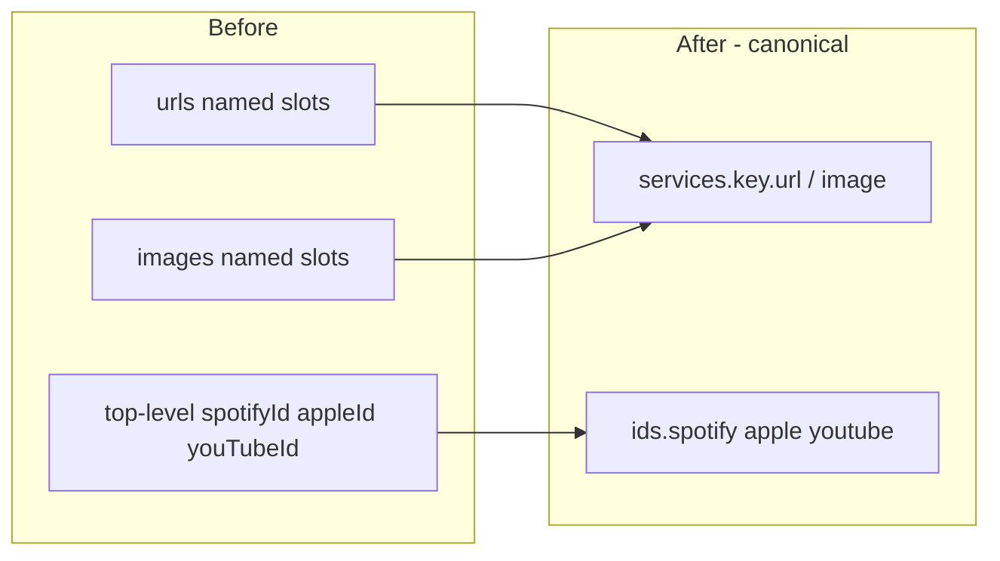
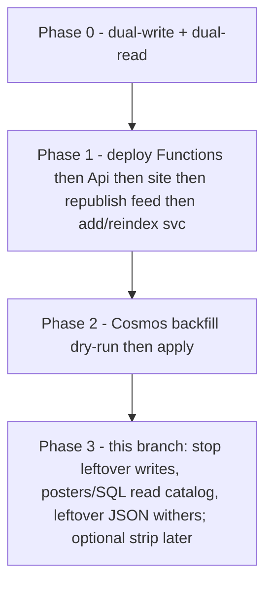

<!-- pragma: allowlist secret -->
# Canvas: one service catalog + nested ids

This is the product/engineering canvas for the service-link work on `cursor/episode-service-links-18b4`.
Authoritative code notes: [episode-services.md](episode-services.md). Rollout mechanics: [episode-services-migration.md](episode-services-migration.md). Loss-of-function / loss-of-data assessment: [episode-services-risk.md](episode-services-risk.md). Ops runbook: [episode-services-ops-runbook.md](episode-services-ops-runbook.md). Deploy plan (diagram + checks): [episode-services-deploy-plan.md](episode-services-deploy-plan.md).

## 1. What changed

We stopped treating listen/watch destinations as a **fixed bag of named URL slots** (`urls.spotify`, `urls.apple`, `urls.youtube`, plus a leftover `urls.bbc` / `urls.internetArchive`, plus a parallel `images.*` bag).

Two adjacent objects on the stored document (and on published public JSON) now do two different jobs:

| Object | Job | Not for |
| --- | --- | --- |
| `services` | Ordered catalog of destinations. Each key is a service identity (`youtube`, `spotify`, `apple`, `bbcIplayer`, `bbcSounds`, `internetArchive`, `vimeo`, `netflix`, `amazonPrime`, or a host slug). Value is `{ url, image }`. | Matching / “do we have Spotify?” |
| `ids` | Presence of reconstructable Spotify / Apple / YouTube. `{ spotify?: string, apple?: long, youtube?: string }`. | Storing Vimeo/Netflix/BBC (those are `services` only) |

Hostname (and BBC path) decide the key. Curator “other URL” rows infer the service. Unknown hosts slug to an alphanumeric key and use the generic external icon.

There is **no** `extraServices` split. Spotify, Apple, YouTube sit in the **same** `services` map as BBC and Vimeo.



Until leftover JSON withers, Cosmos documents may still **contain** both leftover keys and catalog keys. Application code **does not dual-write** leftover members. Search indexer SQL dual-**reads** leftover as fallback.

---

## 2. How it affects the public site

Public cards, hero, search results, saved items, and share/play CTAs all go through the same helpers (`collectEpisodeServices`, `spotifyUrl` / `youtubeUrl` / `appleUrl` / BBC helpers in `search-result-links.ts`). <!-- pragma: allowlist secret -->

**Resolution order** (first hit wins per service):

1. `services.{key}.url`
2. Leftover named feed fields on old R2 JSON (`spotify`, `apple`, `youtube`, `bbc`, `internetArchive`)
3. Reconstruct from `ids` (or search compact `spotifyId` / `youtubeId` / `appleId` + `podcastAppleId`)
4. Compact search `svc` string for non-id services (Sounds, iPlayer, Archive, Vimeo, Netflix, …)

**User-visible impact**

- Play / Watch / listen icons can include Vimeo, Netflix, Prime, distinct BBC Sounds vs iPlayer — not only the old five slots.
- Cover art still coalesces YouTube → Spotify → Apple → remaining service art (unchanged rule).
- Old published feed JSON (flat URL fields, no `services`) still renders. After the feed is republished, leftover named fields disappear and cards use `ids` + `services` only.
- Do **not** ship a site that drops leftover fallbacks before the feed is republished.

**What does not change for visitors**

- Detail pages, rails, and search still show the same cards. <!-- pragma: allowlist secret -->
- Sharing still picks a primary outbound URL via the same YouTube → Spotify → Apple preference, now sourced through the helpers.

---

## 3. How it affects the admin / curator UI

Admin GET (`EpisodeDto` / `ApiEpisode`) is a **superset** during overlap: <!-- pragma: allowlist secret -->

- Still: `urls`, `images`, `spotifyId` / `appleId` / `youTubeId`
- New: `ids`, `services`

The add/edit dialogs keep **dedicated slots** for Spotify, Apple, YouTube (`DEFAULT_UI_SERVICE_KEYS`). Extra destinations are a list of URLs; the service is inferred from the host (label updates as you type).

**PATCH payload today**

- Changes to the three default slots + legacy BBC + Archive still go out as `urls.*` (and `images.*` if art changed).
- Changes to additional catalog keys go out as `services.{key}.url`.
- Server maps leftover-shaped `urls` / `images` on the **request** onto `services` / nested `ids`. It does not write leftover members back onto `Episode`.

**Curator impact**

- You can attach Vimeo / Netflix / Prime / a second BBC product without overloading the single `urls.bbc` slot.
- BBC Sounds and BBC iPlayer are **different keys**. Legacy `urls.bbc` can hold only one URL (iPlayer preferred on sync).
- Matching still uses top-level / nested ids, not “is there a Spotify URL in the form”.
- Phase 3 (later PR): stop sending `urls` from the form once the API accepts `services` + `ids` as the write model.

---

## 4. How it affects tweets and Bluesky posts

**Posters read catalog `services`.** Dual-write is off.

`TweetBuilder` and `BlueskyEmbedCardPostFactory` choose one outbound link from **catalog** `services` (`TryGetPreferredSocialPostUrl`), in this order: <!-- pragma: allowlist secret -->

1. YouTube
2. Spotify
3. Apple
4. Internet Archive
5. BBC iPlayer, then BBC Sounds

If none exist, tweet build throws `No link found to tweet`.

Bluesky embed thumbnails resolve via nested `ids.spotify` (leftover top-level `spotifyId` is ignored on typed `Episode`). <!-- pragma: allowlist secret -->

`hashTag` and posted/tweeted/bluesky flags are unchanged.

Vimeo / Netflix / Prime **do not** appear in tweets today. Adding them is a product decision, not part of this branch.

---

## 5. Data shapes — before vs after

### 5.1 Stored document

**Before**

```json
{
  "spotifyId": "4rOoJ6Egrf8K2IrywzwOMk",
  "appleId": 9876543210,
  "youTubeId": "abc123DEF45",
  "urls": {
    "spotify": "https://open.spotify.com/…",
    "apple": "https://example.com/id1?i=9876543210",
    "youtube": "https://www.youtube.com/watch?v=abc123DEF45",
    "bbc": "https://www.bbc.co.uk/iplayer/…",
    "internetArchive": "https://archive.org/details/foo"
  },
  "images": {
    "youtube": "https://i.ytimg.com/vi/abc123DEF45/hqdefault.jpg",
    "spotify": "https://i.scdn.co/image/…",
    "apple": "https://is1-ssl.mzstatic.com/…",
    "other": "https://ichef.bbci.co.uk/…"
  }
}
```

**After Phase 2 backfill (catalog present; leftover JSON may still sit until wither)**

```json
{
  "spotifyId": "4rOoJ6Egrf8K2IrywzwOMk",
  "appleId": 9876543210,
  "youTubeId": "abc123DEF45",
  "ids": {
    "spotify": "4rOoJ6Egrf8K2IrywzwOMk",
    "apple": 9876543210,
    "youtube": "abc123DEF45"
  },
  "urls": { "spotify": "…", "apple": "…", "youtube": "…", "bbc": "…", "internetArchive": "…" },
  "images": { "youtube": "…", "spotify": "…", "apple": "…", "other": "…" },
  "services": {
    "youtube": { "url": "https://www.youtube.com/watch?v=abc123DEF45", "image": "https://i.ytimg.com/vi/abc123DEF45/hqdefault.jpg" },
    "spotify": { "url": "https://open.spotify.com/…", "image": "https://i.scdn.co/image/…" },
    "apple": { "url": "https://example.com/id1?i=9876543210", "image": "https://is1-ssl.mzstatic.com/…" },
    "bbcIplayer": { "url": "https://www.bbc.co.uk/iplayer/…", "image": "https://ichef.bbci.co.uk/…" },
    "internetArchive": { "url": "https://archive.org/details/foo" }
  }
}
```

BBC art that used to live only in `images.other` hydrates onto `services.bbcIplayer` or `services.bbcSounds`.

### 5.2 Shape-change impact matrix

| Model / payload | Removed or stopped emitting | Added | Still present (overlap) | Impact if a reader is old | Impact if a reader is new |
| --- | --- | --- | --- | --- | --- |
| Cosmos stored item | Nothing deleted in Phase 0–2 | `ids`, `services` | `urls`, `images`, top-level ids | Old Functions still see `urls` | In-memory hydrate always fills `services`/`ids` even when Cosmos has not been backfilled — **do not** use typed `GetAll()` to find gaps |
| Published feed item | Flat `spotify` / `apple` / `youtube` / `bbc` / `internetArchive` URL slots | `ids`, `services` | Coalesced `image` | Site leftover fallbacks keep cards alive until republish | Cards use `services` then `ids` |
| Feed row DTO | Same named URL slots | `ids`, `services` | `images` bag still on this DTO | Same as feed item | Same as feed item |
| Public GET DTO | No bolt-on `urls` object | `ids`, `services` | Coalesced `image` | OpenAPI still allows leftover named URL fields during overlap | Saved-item / detail display maps through the public-to-card helper |
| Admin GET/PATCH DTO | None | `ids`, `services` | `urls`, `images`, top-level ids | Forms unchanged for default slots | Extra services editable; PATCH `services` for non-default keys |
| Site card interface | — | `ids`, `services`, leftover optional named fields | Leftover `spotify`/`apple`/`youtube`/`bbc`/`internetArchive` | N/A | Helpers hide the overlap |
| Site search row | — | `ids`, `services`, `svc` | Compact `spotifyId` / `youtubeId` / `appleId` / `podcastAppleId` / `bbc` / `internetArchive` | Old clients ignore `svc` | `expandSvc` + `ids` reconstruct links |
| Azure Search document | Nothing removed | Retrievable `svc` (manual index add, not this PR) | Compact ids + legacy `bbc` / `internetArchive` | Old site ignores unknown field | Non-id services appear on search cards |
| Tweet / Bluesky input | None | None (still legacy `urls`) | Dual-written `urls` | Posts unchanged | Posts unchanged until Phase 3 |
| Curator PATCH body | None | optional `services` | `urls`, `images` | API still accepts `urls` | Extra keys persist via `services` |

### 5.3 Search `svc` (not a replacement for Spotify/Apple/YouTube)

Spotify / YouTube / Apple stay compact id fields. Other catalog keys compact to:

```
bbcSounds:p0example|vimeo:123456789|netflix:uhttps://www.netflix.com/watch/…
```

Empty string when none (never null — Azure Search merge ignores null). Grammar lives on the compact-`svc` helper. <!-- pragma: allowlist secret -->

---

## 6. Why migration is two tracks (code + data)

`OnDeserialized` calls `NormalizeCatalog` (drop retired `other`, empty ids). Leftover JSON is **not** copied onto typed `Episode`. Candidate selection **must** use raw JSON + `NeedsBackfill`. A cheap `NOT IS_DEFINED(c.services)` misses **partial** maps (YouTube in `services`, Spotify still only on `urls`). <!-- pragma: allowlist secret -->



### Phase 0 — already on the branch

New writes persist both shapes. Search SQL and matching still read `urls` / top-level ids. The site reads new then leftover. No bulk Cosmos write required for new documents.

### Phase 1 — roll out code (order)

1. Azure Functions / indexer / publisher
2. Api Worker (R2 bytes passed through; OpenAPI allows both shapes)
3. Public site (helpers tolerate old feed JSON)
4. Republish the published feed so R2 is `ids` + `services`
5. Add search field `svc`, reindex after Functions that write `svc` are live

### Phase 2 — migrate stored JSON

Tested types: document-migration (`NeedsBackfill`, `SelectDocumentsToBackfill`, `Apply`) and the backfill processor (dry-run default). <!-- pragma: allowlist secret -->

1. Page raw documents
2. Dry-run (`apply: false`) — record candidate count, spot-check
3. Apply in batches — save only when shape actually changed
4. Dry-run again ≈ 0
5. Republish feed / reindex if those still show gaps

`Apply` **keeps** `urls` and top-level ids. This is a backfill, not a delete. Do not run apply against production from an agent session unless that write is explicitly requested.

### Phase 3 — leftover DTO retire (this freeze branch)

Writers stop leftover dual-write. Posters and matching read catalog / nested ids. Search indexer SQL dual-**reads** leftover as fallback. Optional strip of leftover Cosmos keys is later (`NeedsStrip`).

### Rollback

- Revert code: old site leftover fields + old Functions `urls` still work.
- After data apply: documents **gained** `services`/`ids` and kept `urls`. Reverting code is safe. There is no automatic delete of `services`.

---

## 7. Done when

- [ ] Phase 1 deployed in the order above
- [ ] Dry-run then apply; second dry-run ~0
- [ ] Feed republished; search reindexed with `svc`
- [ ] Phase 3 leftover DTO retire on this branch; leftover JSON withers on Save; strip later
- [ ] Tweet/Bsky factories read catalog `services`
