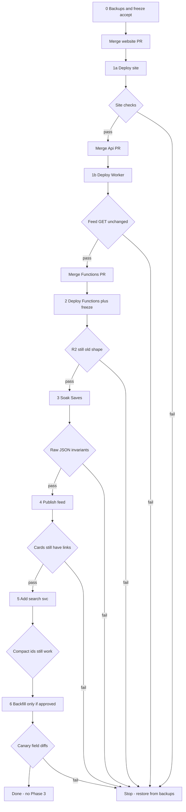

# Deployment plan: service catalog + nested ids

Operator plan. Detail and freeze rules live in the [ops playbook](episode-services-ops-runbook.md). Risk notes: [episode-services-risk.md](episode-services-risk.md).

**Merge order is the release order:** website → Api Worker → Functions. Do not merge all three at once. Do not merge Functions until site + Worker are in production.

No new Worker secrets. Phase 3 (strip `urls`) is not in this plan.

---

## Diagram

Click a node on GitHub to open the matching playbook section. `FAIL` means stop and use the playbook emergency table.

Playbook anchors:

- [0 — Before any production deploy](episode-services-ops-runbook.md#0-before-any-production-deploy)
- [When to merge PRs](episode-services-ops-runbook.md#when-to-merge-prs)
- [1 — Readers first](episode-services-ops-runbook.md#1-readers-first-site--api-worker)
- [2 — Writers](episode-services-ops-runbook.md#2-writers-azure-functions-under-publish-freeze)
- [3 — Soak](episode-services-ops-runbook.md#3-soak-writers-on-old-feed-still-live)
- [4 — Republish the feed](episode-services-ops-runbook.md#4-republish-the-feed-only-after-site--soak)
- [5 — Search `svc`](episode-services-ops-runbook.md#5-search-field-svc-additive-later-the-same-week)
- [6 — Cosmos backfill](episode-services-ops-runbook.md#6-cosmos-backfill-separate-approval--default-is-dry-run-only)
- [7 — Done / do not](episode-services-ops-runbook.md#7-done--do-not-do)
- [Emergency](episode-services-ops-runbook.md#emergency)

---

## Step 0 — Backups (playbook §0)

**Do not merge any PR yet.**

| | |
| --- | --- |
| **Playbook** | [§0](episode-services-ops-runbook.md#0-before-any-production-deploy) |
| **Actions** | Snapshot live R2 feed to a dated file **and** a second R2 key (`content/feed.bak-YYYYMMDD`). Run `CosmosDbDownloader` for the item container only, overwrite off. Screenshot Azure Search fields. Record Functions blob `lastModified`. |
| **Post-step actions** | Store copies off-box. Write down “no feed publish until step 4” and “Functions PR stays open.” If deploy day is Sunday/Monday UTC, plan coverage for 00:00–00:20 UTC. |
| **Expect / check** | You can open the feed backup and still see leftover `spotify` / `apple` / `youtube` (or `urls`). Five Cosmos JSON files still have `urls` and a sensible `lang` (null = English). Search field list includes compact ids + `bbc` + `internetArchive` + `image`. |

**Gate:** snapshots opened with your own eyes. Then merge website only.

---

## Step 1a — Merge website, deploy site (playbook §1 + merge)

| | |
| --- | --- |
| **Playbook** | [Merge](episode-services-ops-runbook.md#when-to-merge-prs) · [§1](episode-services-ops-runbook.md#1-readers-first-site--api-worker) |
| **Actions** | Merge **website** PR to `main`. Deploy Pages. Leave Api + Functions PRs open. |
| **Post-step actions** | Hard-refresh production. Open feed, search, one public detail / saved item. |
| **Expect / check** | Listen/watch icons still work on the **old** feed. Leftover fallbacks are still in the shipped site. No Functions code is on `main`. |

**Gate:** links work. If not, do not merge Api.

---

## Step 1b — Merge Api, deploy Worker (playbook §1)

| | |
| --- | --- |
| **Playbook** | [Merge](episode-services-ops-runbook.md#when-to-merge-prs) · [§1](episode-services-ops-runbook.md#1-readers-first-site--api-worker) |
| **Actions** | Merge **Api** PR to `main`. Deploy preview, then production Worker `api` (not `--env production`). No new secrets. |
| **Post-step actions** | `GET` the live feed through the Worker. Compare to R2 backup A (fields, not just status 200). |
| **Expect / check** | Worker still returns leftover-field JSON (pass-through). Site behaviour unchanged. Functions PR still **unmerged**. |

**Gate:** feed bytes/shape match backup. Then merge Functions.

---

## Step 2 — Merge Functions, deploy writers, freeze (playbook §2)

| | |
| --- | --- |
| **Playbook** | [Merge](episode-services-ops-runbook.md#when-to-merge-prs) · [§2](episode-services-ops-runbook.md#2-writers-azure-functions-under-publish-freeze) |
| **Actions** | Start publish freeze (no admin publish, no edits of items released in the last 7 days). **Then** merge Functions PR to `main`. Same day: `deploy-api.ps1`, `deploy-indexer.ps1` (and the third app if it saves the same item type). |
| **Post-step actions** | Confirm blob `lastModified` is this release. Confirm live R2 etag/timestamp still equals backup A. Open one **raw** Cosmos document you will not edit. |
| **Expect / check** | Functions are new. Feed is **still old shape**. Raw JSON still has `urls`. `services` / `ids` may be missing on untouched rows. |

**Gate:** R2 unchanged. If the feed already flipped, restore backup A before soak.

---

## Step 3 — Soak Saves (playbook §3)

| | |
| --- | --- |
| **Playbook** | [§3](episode-services-ops-runbook.md#3-soak-writers-on-old-feed-still-live) |
| **Actions** | Keep freeze. Edit a **description** on an item **older than 7 days**. Optional: add one extra service URL. Optional: tweet/Bsky on a row that already has a YouTube or Spotify `urls` slot. Try clear-Spotify only to confirm known F4 — do not “fix” with a bulk job. |
| **Post-step actions** | Reload that item as **raw JSON**. Compare to the step-0 snapshot for the same id. |
| **Expect / check** | `urls.*` and top-level ids still present. `services` + `ids` **added**. `lang`, title, description (except your edit) unchanged. Feed on R2 still old. Search compact ids still work. |

**Gate:** no disappeared `urls` / `lang` / title. Then you may publish.

---

## Step 4 — Publish feed (playbook §4)

| | |
| --- | --- |
| **Playbook** | [§4](episode-services-ops-runbook.md#4-republish-the-feed-only-after-site--soak) |
| **Actions** | Human admin publish (or one intentional 7-day edit). End freeze only for this action. |
| **Post-step actions** | Download live feed JSON. Hard-refresh site (second browser). Keep leftover fallbacks in site code. |
| **Expect / check** | Feed has `ids` + `services`. Leftover named URL fields may be gone. Cards, hero, search, detail still show listen/watch. |

**Gate:** icons still there. If not, restore R2 from backup A. Do not revert Functions unless Cosmos looks wrong (publish alone should not rewrite Cosmos).

---

## Step 5 — Search `svc` (playbook §5, optional same week)

| | |
| --- | --- |
| **Playbook** | [§5](episode-services-ops-runbook.md#5-search-field-svc-additive-later-the-same-week) |
| **Actions** | Add retrievable string `svc`. Do not drop compact ids or legacy `bbc` / `internetArchive` / `image`. Reindex after Functions from step 2 are live. |
| **Post-step actions** | Search a row that has Sounds/Vimeo/Netflix (or similar) and a Spotify/YouTube row. |
| **Expect / check** | Extra destination appears when `svc` is populated. Spotify/YouTube/Apple still resolve from compact ids. |

**Gate:** no missing platform on search. Never recreate the index to undo.

---

## Step 6 — Cosmos backfill (playbook §6, separate yes)

Default: **skip apply**. Dual-write fills rows on ordinary saves. Playbook §6 only if you explicitly want stored JSON updated.

| | |
| --- | --- |
| **Playbook** | [§6](episode-services-ops-runbook.md#6-cosmos-backfill-separate-approval--default-is-dry-run-only) |
| **Actions** | New dated downloader snapshot (do not overwrite step 0). Dry-run `apply: false`. Spot-check candidates. Canary 10–50 only after you say the ids. Curation freeze during canary. |
| **Post-step actions** | Diff each canary raw JSON vs snapshot: `urls.*`, top-level ids, `images.*`, `lang`, title, description. Skip rows whose `_ts` moved. Only then consider batches. Re-run dry-run. |
| **Expect / check** | Dry-run after canary: candidates drop. Invariants **additive only**. Second dry-run ≈ 0. |

**Gate:** any missing `urls` or `lang` → stop, restore those ids from the step-6 snapshot, do not batch.

---

## Done

Playbook [§7](episode-services-ops-runbook.md#7-done--do-not-do).

- [ ] Merged website, then Api, then Functions
- [ ] Site + Worker + `api-infra` + `indexer-infra` on this code
- [ ] Feed published **after** the new site was live
- [ ] Feed and a public detail page show the right destinations
- [ ] Search compact ids work; `svc` only if you ran step 5
- [ ] Backfill skipped or canary-diffed
- [ ] No Phase 3, no language inherit job, no index recreate
