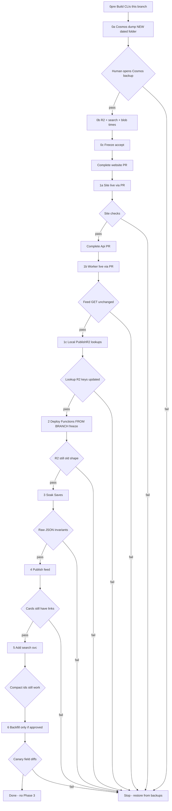

# Deployment plan: service catalog + nested ids

Operator plan. Detail and freeze rules live in the [ops playbook](episode-services-ops-runbook.md). Risk notes: [episode-services-risk.md](episode-services-risk.md).

**Watch this file.** The **Live status** table is edited in place as work happens. Refresh/reopen if the editor does not auto-reload.

## Live status

Updated: **2026-08-29 13:38 BST**

### NOW: Phase 3 — leftover DTO retire (code on #966; Functions not yet this commit)

Phases 0–6 of this deploy plan are **done**. Operator plan: [episode-services-phase-3.md](episode-services-phase-3.md). #966 stays open. No Wrangler/Pages. No strip `--apply`.

`--all --apply` **exit 0** (28 Aug). Scanned **97306** Candidates **97286** Saved **97286**. Spot-check **1000/1000**. Search index still **84714**.

**29 Aug catalog check:** since 21:00 BST 28 Aug: 39 docs, **0** NeedsBackfill. Full dry-run: **97345** / **0**. Nothing to apply.

**#966:** HEAD on origin `29ab3ae9` (leftover CLI + backfill moved off production). Owner comments still being applied. **Catalog `--since-ts` slipped to 15:00 BST** (missed 13:00 and 14:00). Functions still 28 Aug dual-write. No Indexer deploy until named.

**Noted (not blocking 1a):** `other` is not a listen service. Catalog is defined destinations only (including Paramount+, HBO Max, Play Suisse, TVNZ+). Unknown hosts still slug to an alnum key. Leftover `images.other` stays as BBC-style art until wither. Curator “Other” image field is unchanged.

In-progress rows always show **% of that step** (not of the whole rollout).

| Step | Status | % of step | Notes |
| --- | --- | --- | --- |
| 0pre Build CLIs | **done** | **100%** | `CosmosDbDownloader.exe` 12:26, `PublishR2.exe` 12:27 in `artifacts\tools`. |
| 0a Cosmos dump (new dated folder) | **done** | **100%** | `2026-08-28` dump. People included. |
| 0a HITL — you inspect Cosmos dump | **done** | — | You continued. |
| 0b R2 + search + blob times | **done** | **100%** | Homepage leftover URLs. Search: compact ids + **bbc URLs** + internetArchive + image. No retrievable `svc`. |
| 0c Freeze accept | **done** | — | You accepted. No feed until step 4. [#966](https://github.com/cultpodcasts/RedditPodcastPoster/pull/966) open through soak. |
| 1a Website | **done** | **100%** | [#481](https://github.com/cultpodcasts/website/pull/481) `89eef08`. Prod **1.10.112**. Spotify + BBC Sounds seen on leftover feed. |
| 1b Api Worker | **done** | **100%** | [#141](https://github.com/cultpodcasts/Api/pull/141) `013b85da`. GET /homepage leftover URLs, no `services`/`ids`. |
| 1c `PublishR2 lookups` (this branch local) | **done** | **100%** | languages 52, people, search-suggestions 8563, subjects, flairs 333. Not homepage. |
| 2 Functions **from branch** (script) | **done** | **100%** | Indexer 13:20:22Z, Discover 13:27:29Z, api-infra **13:43:40Z**. CS2012 retry used `-SingleNodeMsBuild`. #966 open. |
| 3 Soak | **done** | **100%** | Operator skipped remaining soak wait; named publish + svc + 4-id canary. |
| 4 Publish feed | **done** | **100%** | `PublishR2 homepage` completed. GET leftover URLs gone; lead has `services`+`ids`. |
| 5 Search `svc` + desc 180 | **done** | **100%** | Recreate exit 0. 9/10 Success, **84714** docs, `svc` + SUBSTRING 180. Storage **47,835,315** (91.2%) vs 52,133,148 (99.4%). UI: `search-description.ts`, hero, specs, `1.10.113` (not deployed). |
| 6 Cosmos backfill | **done** | **100%** | exit 0. scanned 97306 candidates 97286 saved 97286 missing 0 mismatches 0. spot-check 1000 ok. 34.4m. |
| P3 leftover retire | **in progress** | — | Code on origin `29ab3ae9`. Catalog check **15:00 BST**. Functions still 28 Aug dual-write. No Indexer deploy until named. |

**Forbidden while this run is live:** `--overwrite` on PrivateDatabase, any write into `2026-08-15`, `PublishR2 all`, **completing/merging [RPP #966](https://github.com/cultpodcasts/RedditPodcastPoster/pull/966)**, `wrangler deploy` / `npm run deploy` for Api or website, search index teardown/recreate.

**Ship path:** website + Api Worker = **complete those PRs**. Functions = **script-deploy from the open branch** (`cursor/episode-service-links-18b4`). Leave [#966](https://github.com/cultpodcasts/RedditPodcastPoster/pull/966) open through soak. Blob `lastModified` is production truth.

No new Worker secrets. Phase 3 detail: [episode-services-phase-3.md](episode-services-phase-3.md).

---

## Diagram

Click a node on GitHub to open the matching playbook section. `FAIL` means stop and use the playbook emergency table.

Playbook anchors:

- [0 — Before any production deploy](episode-services-ops-runbook.md#0-before-any-production-deploy)
- [0a — Cosmos backup HITL](episode-services-ops-runbook.md#0a-cosmos-backup--hard-stop)
- [When to merge PRs](episode-services-ops-runbook.md#when-to-merge-prs)
- [1 — Readers first](episode-services-ops-runbook.md#1-readers-first-site--api-worker)
- [1c — Edge lookup republish](episode-services-ops-runbook.md#1c-republish-r2-lookup-json-from-this-branch-local-build)
- [2 — Writers](episode-services-ops-runbook.md#2-writers-azure-functions-under-publish-freeze)
- [3 — Soak](episode-services-ops-runbook.md#3-soak-writers-on-old-feed-still-live)
- [4 — Republish the feed](episode-services-ops-runbook.md#4-republish-the-feed-only-after-site--soak)
- [5 — Search `svc`](episode-services-ops-runbook.md#5-search-field-svc-additive-later-the-same-week)
- [6 — Cosmos backfill](episode-services-ops-runbook.md#6-cosmos-backfill-separate-approval--default-is-dry-run-only)
- [7 — Done / do not](episode-services-ops-runbook.md#7-done--do-not-do)
- [Emergency](episode-services-ops-runbook.md#emergency)

---

## Step 0pre — Build CLIs (this branch)

**Do not merge. Do not write Cosmos. Do not touch existing PrivateDatabase folders.**

| | |
| --- | --- |
| **Actions** | On `cursor/episode-service-links-18b4`, `.\scripts\publish-console-apps.ps1 -Confirm:$false`. Output is `artifacts\tools\` in this repo, **not** PrivateDatabase. |
| **Expect / check** | `CosmosDbDownloader.exe` and `PublishR2.exe` in `artifacts\tools` are dated this run. |

**Gate:** CLIs built. Then Cosmos dump only.

---

## Step 0a — Cosmos backup (HITL — stop)

Dump into a **new dated folder** under `C:\Users\jonbr\source\repos\CultPodcasts-PrivateDatabase`. **Never** write into an existing dated folder (today: `2026-08-15` is off-limits). Overwrite **off**.

| | |
| --- | --- |
| **Playbook** | [§0a](episode-services-ops-runbook.md#0a-cosmos-backup--hard-stop) |
| **Actions** | `mkdir` `CultPodcasts-PrivateDatabase\YYYY-MM-DD` (today’s date, folder must not already exist). `cd` there. Run **this branch’s** `CosmosDbDownloader` (no `--overwrite`). Default = all downloader containers except Activities (tool does not download Activities). |
| **Post-step actions** | **STOP.** Open the folder and spot-check files. Agent must not continue until you name the next step (e.g. “Cosmos backup looks good — continue 0b”). |
| **Expect / check** | New sibling of `2026-08-15` only. `2026-08-15` timestamps unchanged. Episode JSON still has `urls` and a sensible `lang`. People JSON present if the tool supports `people`. |

**Gate:** you have opened the new dump. **Fail** if anything was written into `2026-08-15` or files were overwritten.

---

## Step 0b — Remaining backups (only after 0a pass)

**Do not merge any PR yet.**

| | |
| --- | --- |
| **Playbook** | [§0](episode-services-ops-runbook.md#0-before-any-production-deploy) |
| **Actions** | Snapshot live R2 **feed** to a dated file **and** a second R2 key (`content/feed.bak-YYYYMMDD`). Snapshot live R2 **lookup** objects (`languages`, `people`, `subjects`, `flairs`, `search-suggestions`) to dated local files **outside** existing PrivateDatabase dated folders. Screenshot Azure Search fields. Record Functions blob `lastModified`. |
| **Post-step actions** | Store copies off-box. Write down “no feed publish until step 4” and “Functions PR stays open.” |
| **Expect / check** | Feed backup still has leftover `spotify` / `apple` / `youtube` (or `urls`). Search field list includes compact ids + `bbc` + `internetArchive` + `image`. |

**Gate:** snapshots opened. Then freeze-accept; then merge website only.

---

## Step 1a — Complete website PR (playbook §1)

Site production is **the completed PR**, not a local Pages/`wrangler` deploy.

**PR:** [cultpodcasts/website#481](https://github.com/cultpodcasts/website/pull/481)

| | |
| --- | --- |
| **Playbook** | [Merge](episode-services-ops-runbook.md#when-to-merge-prs) · [§1](episode-services-ops-runbook.md#1-readers-first-site--api-worker) |
| **Actions** | Complete [website #481](https://github.com/cultpodcasts/website/pull/481) to `main`. Leave [Api #141](https://github.com/cultpodcasts/Api/pull/141) and [Functions #966](https://github.com/cultpodcasts/RedditPodcastPoster/pull/966) open. Do **not** `npm run deploy` / `wrangler pages deploy`. |
| **Post-step actions** | Wait until production site is serving that merge. Hard-refresh. Open feed, search, one public detail / saved item. |
| **Expect / check** | Listen/watch icons still work on the **old** feed. Leftover fallbacks are still in the shipped site. No Functions code is on `main`. Catalog has no `other` listen service; leftover `images.other` is art. |

**Gate:** links work. If not, do not complete the Api PR.

---

## Step 1b — Complete Api Worker PR (playbook §1)

Worker production is **the completed PR**, not `wrangler deploy` / `npm run deploy` from this run. Live Worker is top-level `api` (not `--env production`).

**PR:** [cultpodcasts/Api#141](https://github.com/cultpodcasts/Api/pull/141)

| | |
| --- | --- |
| **Playbook** | [Merge](episode-services-ops-runbook.md#when-to-merge-prs) · [§1](episode-services-ops-runbook.md#1-readers-first-site--api-worker) |
| **Actions** | After the site is live: complete [Api #141](https://github.com/cultpodcasts/Api/pull/141) to `main`. No new secrets. Do **not** run Wrangler deploy from this agent. |
| **Post-step actions** | `GET` the live feed through the Worker. Compare to R2 backup A (fields, not just status 200). |
| **Expect / check** | Worker still returns leftover-field JSON (pass-through). Site behaviour unchanged. Functions PR still **unmerged**. |

**Gate:** feed bytes/shape match backup. Then step **1c** (lookup republish). Do **not** merge Functions yet.

---

## Step 1c — Republish R2 lookup JSON from this branch (playbook §1c)

**Do not merge Functions yet.** Do **not** publish the feed or homepage.

Lookup objects on the Worker `Content` bucket are generated **from Cosmos** by `PublishR2`. Auth0 and Azure Search are separate. Homepage, `homepage-ssr`, `discovery-info`, and the **feed** are not lookups — leave them until later gates.

| | |
| --- | --- |
| **Playbook** | [§1c](episode-services-ops-runbook.md#1c-republish-r2-lookup-json-from-this-branch-local-build) |
| **Actions** | On `cursor/episode-service-links-18b4`, build and run **this branch’s** `PublishR2` locally (`dotnet run --project Console-Apps/PublishR2 -- lookups`). Do **not** use a PATH `PublishR2` from an older `publish-console-apps.ps1`. Do **not** `PublishR2 all` or `homepage`. |
| **Post-step actions** | `GET` `/languages`, `/people`, `/subjects`, `/flairs`, `/search-suggestions` through the production Worker. Confirm feed GET still matches backup A. |
| **Expect / check** | Those five R2 keys updated from this branch’s publishers. Feed etag/shape still equals backup A. Homepage unchanged. |

**Gate:** lookup Worker routes still 200 with sensible JSON; feed unchanged. Then step **2** (Functions from branch). **Do not complete [#966](https://github.com/cultpodcasts/RedditPodcastPoster/pull/966).**

---

## Step 2 — Deploy Functions from the open branch, freeze (playbook §2)

**Do not complete [RPP #966](https://github.com/cultpodcasts/RedditPodcastPoster/pull/966).** Keep the branch/PR open through soak. Production Functions are script-deployed from `cursor/episode-service-links-18b4`.

**PR (leave open):** [cultpodcasts/RedditPodcastPoster#966](https://github.com/cultpodcasts/RedditPodcastPoster/pull/966)

| | |
| --- | --- |
| **Playbook** | [§2](episode-services-ops-runbook.md#2-writers-azure-functions-under-publish-freeze) |
| **Actions** | Start publish freeze (no admin publish, no edits of items released in the last 7 days). On this branch: `deploy-indexer.ps1`, `deploy-discover.ps1`, `deploy-api.ps1` (`-Confirm:$false`, known Azure targets). Do **not** merge [#966](https://github.com/cultpodcasts/RedditPodcastPoster/pull/966). |
| **Post-step actions** | Confirm blob `lastModified` is this release. Confirm live R2 etag/timestamp still equals backup A. Open one **raw** Cosmos document you will not edit. [#966](https://github.com/cultpodcasts/RedditPodcastPoster/pull/966) still draft/open. |
| **Expect / check** | Functions are new (from branch). Feed is **still old shape**. Raw JSON still has `urls`. `services` / `ids` may be missing on untouched rows. |

**Gate:** R2 unchanged. If the feed already flipped, restore backup A before soak.

---

## Step 3 — Soak Saves (playbook §3)

| | |
| --- | --- |
| **Playbook** | [§3](episode-services-ops-runbook.md#3-soak-writers-on-old-feed-still-live) |
| **Actions** | Keep freeze. Edit a **description** on an item **older than 7 days**. Optional: add one extra service URL. Optional: tweet/Bsky on a row that already has a YouTube or Spotify `urls` slot. Try clear-Spotify only to confirm known F4 — do not “fix” with a bulk job. |
| **Post-step actions** | Reload that item as **raw JSON**. Compare to the step-0 snapshot for the same id. |
| **Expect / check** | `urls.*` and top-level ids still present. `services` + `ids` **added**. `lang`, title, description (except your edit) unchanged. Feed on R2 still old. Search compact ids still work. |

**Gate:** no disappeared `urls` / `lang` / title. Then you may publish.

---

## Step 4 — Publish feed (playbook §4)

| | |
| --- | --- |
| **Playbook** | [§4](episode-services-ops-runbook.md#4-republish-the-feed-only-after-site--soak) |
| **Actions** | Human admin publish (or one intentional 7-day edit). End freeze only for this action. |
| **Post-step actions** | Download live feed JSON. Hard-refresh site (second browser). Keep leftover fallbacks in site code. |
| **Expect / check** | Feed has `ids` + `services`. Leftover named URL fields may be gone. Cards, hero, search, detail still show listen/watch. |

**Gate:** icons still there. If not, restore R2 from backup A. Do not revert Functions unless Cosmos looks wrong (publish alone should not rewrite Cosmos).

---

## Step 5 — Search `svc` (playbook §5, optional same week)

| | |
| --- | --- |
| **Playbook** | [§5](episode-services-ops-runbook.md#5-search-field-svc-additive-later-the-same-week) |
| **Actions** | Add retrievable string `svc`. Do not drop compact ids or legacy `bbc` / `internetArchive` / `image`. Reindex after Functions from step 2 are live. |
| **Post-step actions** | Search a row that has Sounds/Vimeo/Netflix (or similar) and a Spotify/YouTube row. |
| **Expect / check** | Extra destination appears when `svc` is populated. Spotify/YouTube/Apple still resolve from compact ids. |

**Gate:** no missing platform on search. Never recreate the index to undo.

---

## Step 6 — Cosmos backfill (playbook §6, separate yes)

Default: **skip apply**. Dual-write fills rows on ordinary saves. Playbook §6 only if you explicitly want stored JSON updated.

| | |
| --- | --- |
| **Playbook** | [§6](episode-services-ops-runbook.md#6-cosmos-backfill-separate-approval--default-is-dry-run-only) |
| **Actions** | New dated downloader snapshot (do not overwrite step 0). Dry-run `apply: false`. Spot-check candidates. Canary 10–50 only after you say the ids. Curation freeze during canary. |
| **Post-step actions** | Diff each canary raw JSON vs snapshot: `urls.*`, top-level ids, `images.*`, `lang`, title, description. Skip rows whose `_ts` moved. Only then consider batches. Re-run dry-run. |
| **Expect / check** | Dry-run after canary: candidates drop. Invariants **additive only**. Second dry-run ≈ 0. |

**Gate:** any missing `urls` or `lang` → stop, restore those ids from the step-6 snapshot, do not batch.

---

## Done

Playbook [§7](episode-services-ops-runbook.md#7-done--do-not-do).

- [ ] Completed [website #481](https://github.com/cultpodcasts/website/pull/481), then [Api #141](https://github.com/cultpodcasts/Api/pull/141). **Did not complete [#966](https://github.com/cultpodcasts/RedditPodcastPoster/pull/966).** Functions script-deployed from the open branch; PR stayed open through soak
- [ ] Site + Worker + `api-infra` + `indexer-infra` on this code
- [ ] R2 lookup keys republished from **this branch’s** local `PublishR2 lookups` (not homepage / not feed)
- [ ] Feed published **after** the new site was live
- [ ] Feed and a public detail page show the right destinations
- [ ] Search compact ids work; `svc` only if you ran step 5
- [ ] Backfill skipped or canary-diffed
- [ ] No Phase 3, no language inherit job, no index recreate
