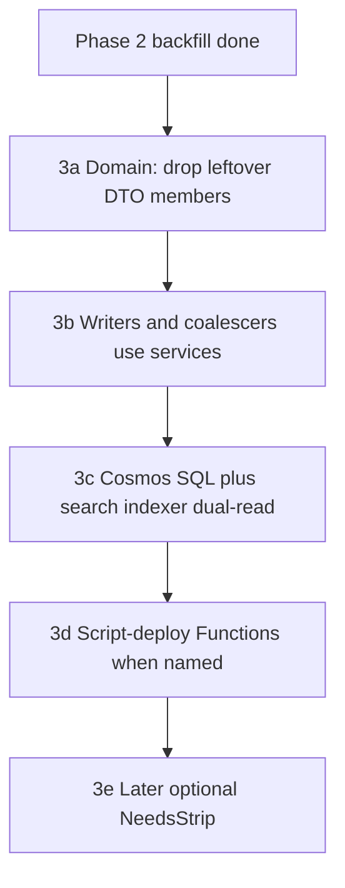

# Episode services Phase 3 — retire leftover members

Phases 0–2 (deploy + Cosmos backfill) are **done**. This is the operator plan for stopping leftover dual-write. It is **not** approval to merge [#966](https://github.com/cultpodcasts/RedditPodcastPoster/pull/966), deploy Wrangler/Pages, recreate search, or run a strip `--apply`.

Watch file: [episode-services-deploy-plan.md](episode-services-deploy-plan.md). Risk notes from 0–2 still apply for full `Save()` wither: [episode-services-risk.md](episode-services-risk.md) D1 / D8 / F4 / F6.

## Canonical vs leftover

| Keep (source of truth) | Retire (wither on full `Save`) |
|---|---|
| `services.{key}.{url,image}` | `urls.*` |
| nested `ids.{spotify,apple,youtube}` | top-level `spotifyId` / `appleId` / `youTubeId` |
| Search **index** compact fields `spotifyId` / `youtubeId` / `appleId` / `image` / `svc` | `images.youtube` / `spotify` / `apple` / `other` |

Cover art coalesces from `services.*.image` using `ServiceCatalog.ImageCoalesceOrder` (YouTube → Spotify → Apple → remaining catalog keys). Application code **never writes** leftover members. Cosmos SQL **may dual-read** leftover JSON until unsaved rows wither.

## 3a — Episode DTO

Remove leftover properties from `Episode`: `Urls`, top-level ids, `Images`. `OnSerializing` calls `NormalizeCatalog` (drop `other`, empty `ids`). Empty `services` → null. Leftover JSON is ignored on deserialize and omitted on serialize.

## 3b — App writers and readers

Inbound admin `Urls` / `Images` on the **request** DTO still map onto `EpisodeServicePresence.Upsert` + nested ids. Admin GET may **project** those shapes from the catalog. Enrichers, posters, search image, shortener, and Cosmos LINQ categorisers use catalog + nested ids only.

Website PATCH may still send leftover-shaped fields this slice. Stopping that form payload is a later website PR.

## 3c — Search indexer SQL (not index recreate)

Indexer query prefers `e.ids.*` / `e.services.*`. Leftover `e.urls.*`, top-level ids, and `e.images.*` are **read fallback** only. Compact `image` tokens stay lossless (`y`/`s`/`a` + full URL). Do not drop search fields. Push the indexer definition on the next **named** Functions deploy.

## 3d / 3e

- **3d:** Script-deploy when the operator names that deploy. Soak: hourly `AppRequests`, curator clear-slot, tweet/Bsky, one full `Save` omits leftover JSON.
- **3e later:** optional `NeedsStrip` dry-run / `--apply`. Not the same PR or day as 3a–3d.

## Done when

- No leftover url/id/images members on `Episode`; no app writes to them.
- Cover art coalesces from catalog services.
- Indexer SQL prefers `services`/`ids`, leftover JSON read-fallback only.
- Wither observed on a real `Save`. Strip not required.
