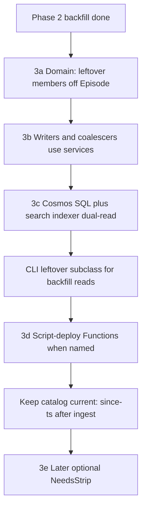

# Episode services Phase 3 — retire leftover members

Phases 0–2 (Functions dual-write deploy + Cosmos catalog backfill + search `svc`) are **done**. This file is the operator plan for leftover DTO retire. It is **not** approval to merge [#966](https://github.com/cultpodcasts/RedditPodcastPoster/pull/966), deploy Wrangler/Pages, recreate search, or run a strip `--apply`.

Watch file: [episode-services-deploy-plan.md](episode-services-deploy-plan.md). Full-document `Save()` still withers leftover JSON keys: [episode-services-risk.md](episode-services-risk.md) D1 / D8.

**Updated:** 2026-08-29 11:48 BST.

## Can we proceed — no data loss, quality code?

**Yes, with the gates below.** Catalog listen URLs, nested ids, and cover art on `services.*.image` are the source of truth and are already on Cosmos. Leftover `urls` / top-level ids / `images` are retired from typed `Episode`; they **wither** (omitted on the next full `Save`), they are not stripped this slice.

| Gate | Status |
| --- | --- |
| Phase 2 `--all --apply` | Done 28 Aug: scanned 97306, saved 97286, mismatches 0, spot-check 1000/1000 |
| Ingest since 21:00 BST 28 Aug (`_ts` > `1787947200`) | 39 documents, **0** `NeedsBackfill` |
| Full-container dry-run 29 Aug | scanned **97345**, candidates **0** |
| Production Functions | Still **pre–Phase 3** (28 Aug script-deploy). New indexer Saves still dual-write leftover JSON **and** catalog |
| #966 code quality | Architect review: **ship-quality for Phase 3** if catalog is complete. Should-fix items landed in `d0dbad11`. Leftover CLI subclass is local (not pushed) |
| 11:00 BST 29 Aug indexer slot | **Missed** for a Phase 3 Indexer deploy (now 11:48 BST). Next hourly is **12:03 BST** (11:03 UTC) if you **name** a script-deploy |

**Data-loss posture**

- Surgical backfill patches **only** `/services` and `/ids`. It does not delete leftover JSON, title, description, `lang`, or guests.
- Typed `Episode` no longer has leftover members, so a **full upsert** after Phase 3 Functions omit leftover keys. Catalog stays. That is wither, not strip.
- Search indexer SQL **dual-reads** leftover JSON until those keys wither. Compact search fields (`spotifyId` / `youtubeId` / `appleId` / `image` / `svc`) stay.
- Do **not** run `NeedsStrip` this slice.
- Keep catalog current: after each hourly/discovery window until Phase 3 Functions are live, `--since-ts` dry-run; `--apply` only if candidates > 0.

**Quality posture**

- App writers: catalog + nested ids only. `SyncLegacy` is gone. F4 clear-slot maps empty request `urls` onto `Upsert(null)` + clear nested ids.
- Review should-fix done: `Classify()` merges leftover before empty-catalog skip; duplicate-finder SQL prefers `e.ids.*`; docs no longer claim dual-write is on.
- **Before Functions deploy:** commit/push CLI `LeftoverEpisodeDocument : Episode` (retired members read-only on the subclass). Do not persist that type.

## Canonical vs leftover

| Keep (source of truth) | Retire (wither on full `Save`) |
| --- | --- |
| `services.{key}.{url,image}` | `urls.*` |
| nested `ids.{spotify,apple,youtube}` | top-level `spotifyId` / `appleId` / `youTubeId` |
| Search **index** compact fields `spotifyId` / `youtubeId` / `appleId` / `image` / `svc` | `images.youtube` / `spotify` / `apple` / `other` |

Cover art coalesces from `services.*.image` using `ServiceCatalog.ImageCoalesceOrder` (YouTube → Spotify → Apple → remaining catalog keys). Application code **never writes** leftover members. Cosmos SQL **may dual-read** leftover JSON until unsaved rows wither.

## PR state ([#966](https://github.com/cultpodcasts/RedditPodcastPoster/pull/966))

Branch: `cursor/episode-service-links-18b4`. **Do not merge.**

| Commit | What |
| --- | --- |
| `f4e05758` | Retire leftover `Episode` members; catalog writers; indexer SQL dual-read; tests |
| `d0dbad11` | Review should-fix: `Classify()` leftover merge, duplicate-finder nested ids, docs match Phase 3 |
| **Working tree (uncommitted)** | CLI `LeftoverEpisodeDocument : Episode` + `LeftoverEpisodeCatalogPatchSource`; processor `IEpisodeCatalogPatchSource` |

Functions on production are **not** this commit yet. Live indexer still dual-writes leftover JSON.

## PR review (architect)

**Verdict:** ship-quality for Phase 3 if Cosmos catalog is complete (it is: 0 remaining candidates).

Landed in `d0dbad11`:

- `Classify()` was labelling leftover-only JSON `services_and_ids_both_null` because typed deserialize ignores leftover. Apply/`TryCreate` was already correct. Classify now merges leftover first.
- Duplicate-finder / search duplicate SQL prefer `e.ids.*` with leftover id fallback.
- Docs/comments no longer claim `Hydrate` / `SyncLegacy` dual-write is current. F4 is fixed on this branch.

Keep (not defects):

- Indexer SQL leftover **read** fallback until wither.
- Admin request DTO leftover-shaped PATCH → catalog (website form later).
- Optional `NeedsStrip` later.

## 3a — Episode DTO

Leftover properties are **off** `Episode`: `Urls`, top-level ids, `Images`. `OnSerializing` / `OnDeserialized` call `NormalizeCatalog` (drop retired catalog key `other`, empty `ids`). Empty `services` → null. Leftover JSON is ignored on deserialize and omitted on serialize.

## 3b — App writers and readers

Inbound admin `Urls` / `Images` on the **request** DTO still map onto `EpisodeServicePresence.Upsert` + nested ids. Admin GET may **project** those shapes from the catalog. Enrichers, posters, search image, shortener, and Cosmos LINQ categorisers use catalog + nested ids only.

Website PATCH may still send leftover-shaped fields this slice. Stopping that form payload is a later website PR.

## 3c — Search indexer SQL (not index recreate)

Indexer query prefers `e.ids.*` / `e.services.*`. Leftover `e.urls.*`, top-level ids, and `e.images.*` are **read fallback** only. Compact `image` tokens stay lossless (`y`/`s`/`a` + full URL). Do not drop search fields. Push the indexer definition on the next **named** Functions deploy (CreateSearchIndex is a console; Azure Search indexer SQL lives with Functions datasource — confirm what the Indexer app actually pushes vs `CreateSearchIndex`).

Hourly **Indexer** function uses in-process `ToEpisodeSearchRecord` / catalog coalesce, not leftover DTO members.

## Backfill CLI

Console `EpisodeServiceBackfill`:

- Production `Episode` has no leftover members.
- CLI **`LeftoverEpisodeDocument : Episode`** adds read-only `urls`, top-level ids, `images` for Cosmos JSON deserialize. Never save that type.
- `LeftoverEpisodeCatalogPatchSource` builds surgical `services`/`ids` patches. Library tests can still use `JsonEpisodeCatalogPatchSource` (`JsonElement` merge).
- `--since-ts` classifies (and with `--apply` patches) by `_ts`. Does not overwrite `episode-service-backfill-patches.jsonl`.
- Default is dry-run. `--apply` only when named.

## Keep catalog current (ingest after 21:00 BST 28 Aug)

Indexer/discovery on **current** production Functions still dual-write leftover + catalog, so new rows should already have `services`/`ids`. Measured:

- Window `_ts` > 21:00 BST 28 Aug: **39** hits, **0** candidates.
- Full scan 29 Aug: **97345** / **0**.

Until Phase 3 Functions are live, after each hourly/discovery: `--since-ts <unix>` dry-run. Apply only if `NeedsBackfill` > 0. After Phase 3 Indexer is live, new Saves wither leftover on full upsert; catalog-only writes need no leftover merge.

## 3d — Script-deploy Indexer (named)

Phrase **deploy functions & clis** (or an explicit “deploy Indexer”) is the deploy approval. Order remains Indexer → Discover → Api.

**11:00 BST 29 Aug hourly:** too late to land Phase 3 Indexer for that slot. Next slot **12:03 BST** (11:03 UTC) if you name the deploy in time to finish blob upload + restart (script always restarts; blob `lastModified` is deploy truth).

Soak after deploy: `AppRequests` for `HourlyOrchestration` / `activity:Indexer` (not traces alone), curator clear-slot, tweet/Bsky, one full `Save` omits leftover JSON.

## 3e — later

Optional `NeedsStrip` dry-run / `--apply`. Not the same PR or day as 3a–3d.

## Done when

- No leftover url/id/images members on `Episode`; no app writes to them.
- Cover art coalesces from catalog services.
- Indexer SQL prefers `services`/`ids`, leftover JSON read-fallback only.
- CLI leftover subclass is the only leftover-member type; not persisted.
- Phase 3 Functions script-deployed when named; leftover JSON withers on Save.
- Catalog stays complete: `--since-ts` clean after ingest windows.
- Strip not required.
