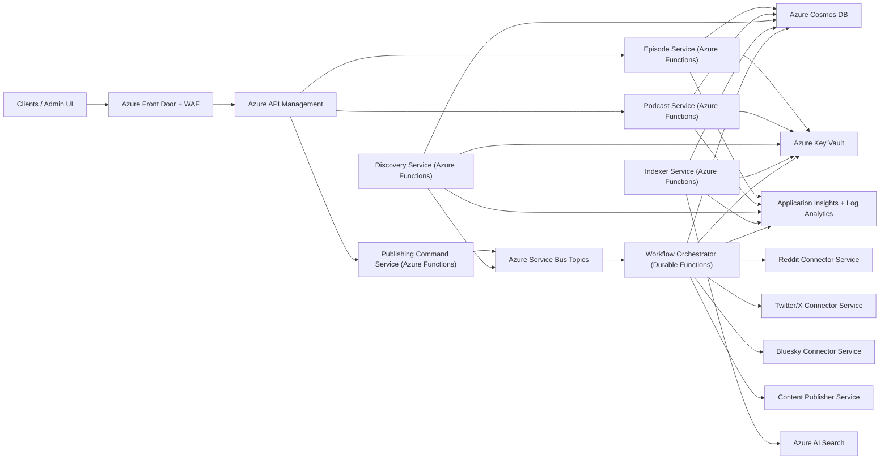

# Azure Functions Microservices Reference Architecture

This is a proposed decomposition of the current Functions-based system into microservices, with Azure-native supporting services for API governance, async workflows, security, and observability.

## Suggested service boundaries
- Episode API/commands
- Podcast API/commands
- Discovery ingestion
- Indexing/search projection
- Publishing orchestration (post/tweet/bluesky)

## Azure service roles
- **Azure API Management**: auth, throttling, API versioning, policy control
- **Azure Service Bus**: async event-driven communication between services
- **Durable Functions**: resilient fan-out/fan-in workflows and retries
- **Cosmos DB**: service-owned data containers and read/write isolation
- **Azure AI Search**: read/search projection owned by indexing service
- **Key Vault + Managed Identity**: secure secretless runtime access
- **Application Insights**: distributed tracing and operational telemetry